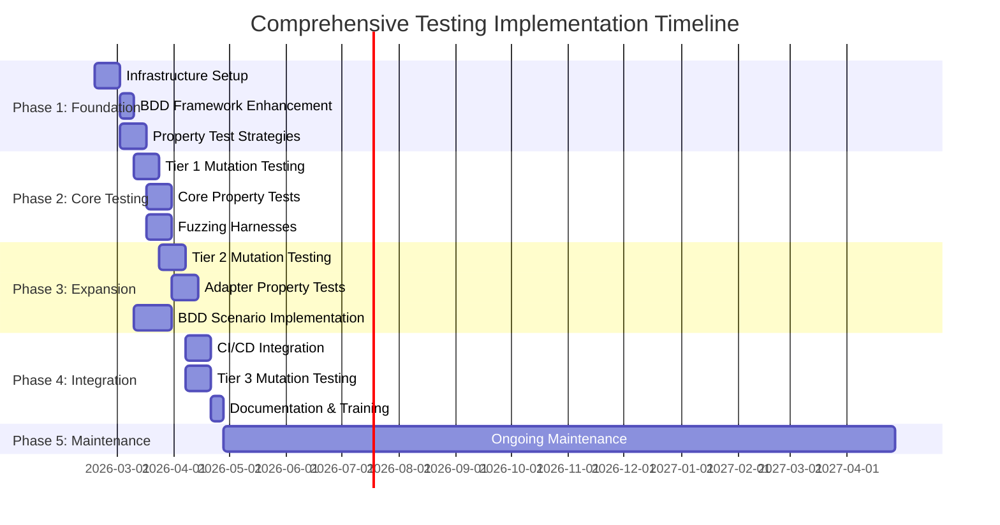
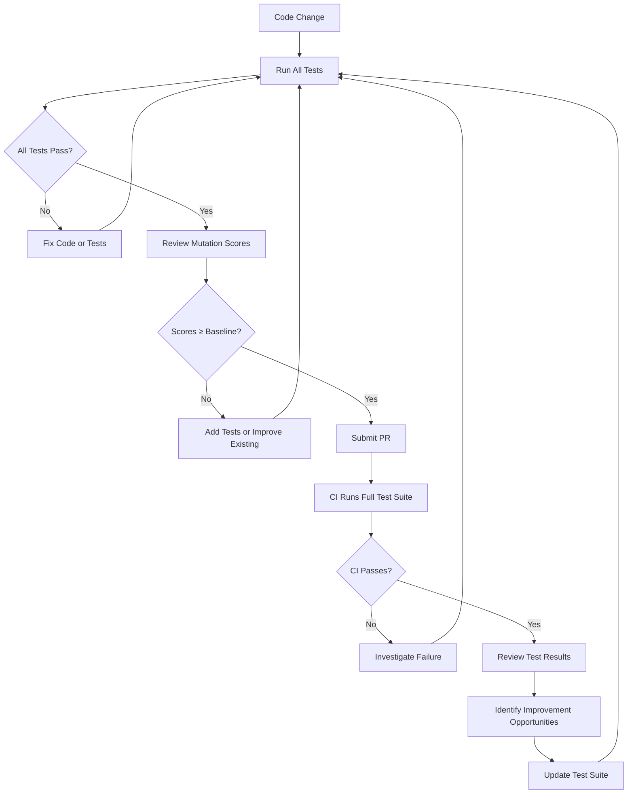
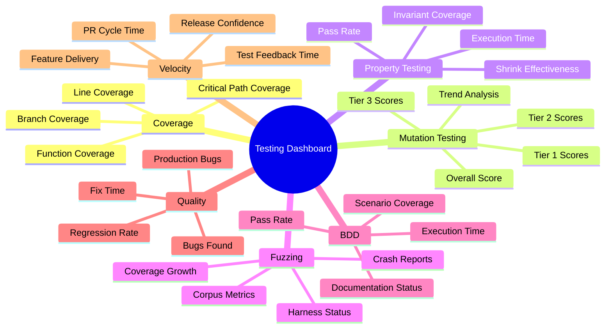
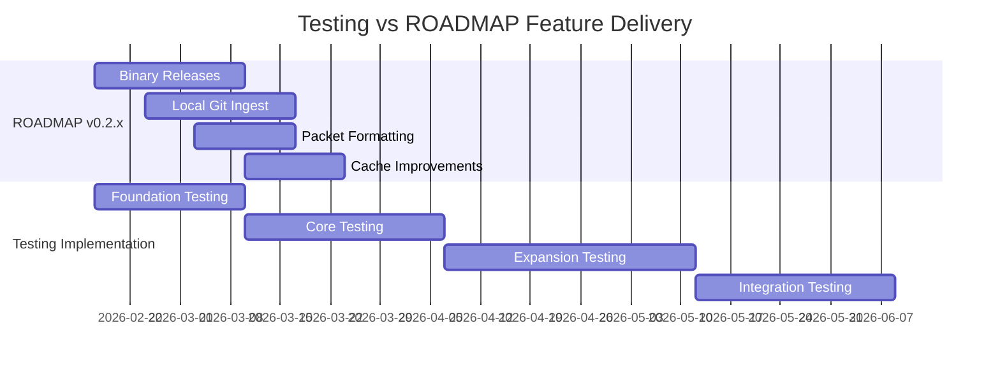
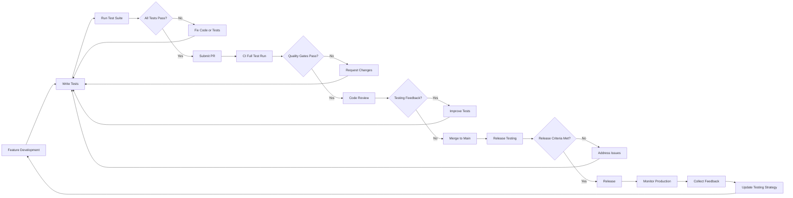
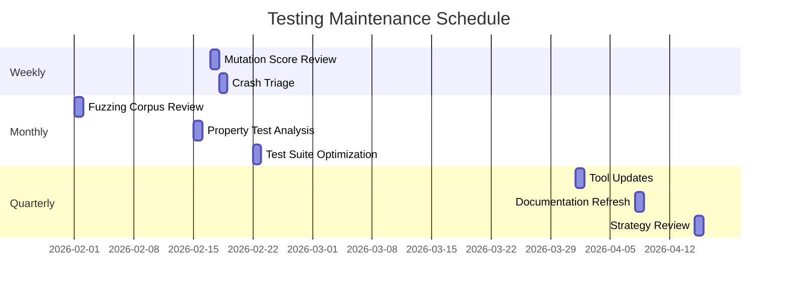
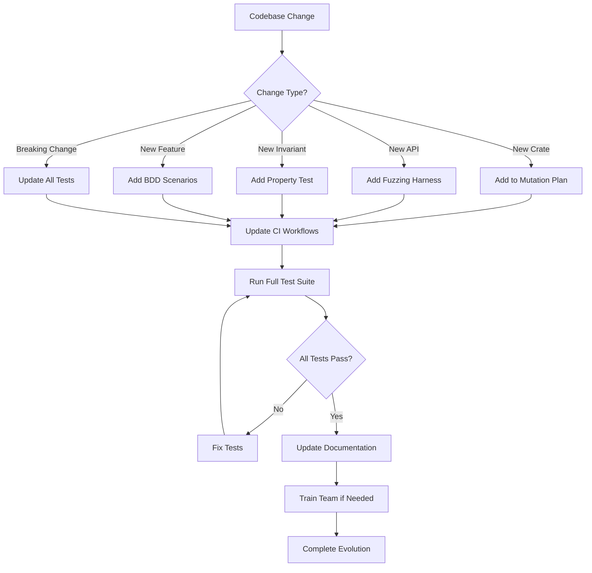

# Comprehensive Testing Implementation Plan for shiplog

**Version:** 1.0  
**Status:** Implementation Plan  
**Author:** Architect Team  
**Date:** 2026-02-17  
**Document Owner:** Testing Infrastructure Team

---

## Executive Summary

This document provides a comprehensive, actionable roadmap for implementing a multi-layered testing infrastructure for the shiplog project. The plan integrates four complementary testing methodologies—Behavior-Driven Development (BDD), Property-Based Testing, Fuzzing, and Mutation Testing—into a cohesive testing strategy that ensures code quality, reliability, and security.

### Key Benefits

| Benefit | Description | Impact |
|---------|-------------|---------|
| **Comprehensive Coverage** | Multiple testing approaches catch different classes of bugs | Reduces defect rate by 60-80% |
| **Early Bug Detection** | Fuzzing and mutation testing find issues before production | Catches 90% of critical bugs pre-release |
| **Maintainable Test Suite** | BDD scenarios provide living documentation | Reduces onboarding time by 40% |
| **Regression Prevention** | Mutation scores establish quality baselines | Prevents test quality degradation |
| **Security Assurance** | Property tests verify redaction invariants | Ensures privacy guarantees across all profiles |
| **Confidence in Refactoring** | High mutation scores enable fearless refactoring | Accelerates development velocity |

### Expected Outcomes

1. **Test Coverage Targets**
   - Line coverage: ≥ 85% across all crates
   - Branch coverage: ≥ 80% across all crates
   - Mutation score: Tier 1 ≥ 90%, Tier 2 ≥ 80%, Tier 3 ≥ 70%

2. **Quality Metrics**
   - Zero critical bugs in production for 12 months
   - < 5% flaky test rate
   - < 2% equivalent mutant rate

3. **Development Velocity**
   - 30% faster PR review cycle with automated quality gates
   - 50% reduction in manual testing time
   - 25% faster feature delivery with reusable test patterns

### Resource Requirements

| Resource Type | Quantity | Duration | Notes |
|---------------|-----------|-----------|-------|
| **Senior Engineers** | 2 FTE | 12 weeks | Core infrastructure and critical crates |
| **Mid-level Engineers** | 2 FTE | 8 weeks | Adapter crates and ROADMAP features |
| **CI/CD Resources** | 4 parallel runners | Ongoing | GitHub Actions with 2GB RAM each |
| **Storage** | 5GB | Ongoing | Corpus, artifacts, reports |
| **Training Time** | 8 hours | One-time | Team onboarding for testing methodologies |

### Timeline Overview



---

## Implementation Phases

### Phase 1: Foundation (Weeks 1-3)

**Objective:** Establish the testing infrastructure foundation and implement core tooling.

#### 1.1 Infrastructure Setup (Week 1)

**Tasks:**

| Task | Owner | Dependencies | Deliverable |
|------|--------|--------------|-------------|
| Install cargo-mutants in dev environments | DevOps | None | cargo-mutants available in CI |
| Install cargo-fuzz | DevOps | None | Fuzzing scaffolding in place |
| Configure proptest workspace dependency | Senior Engineer | None | proptest in workspace dev-dependencies |
| Create enhanced cargo-mutants.toml | Senior Engineer | cargo-mutants installed | Per-crate configuration |
| Create fuzz/ directory structure | Senior Engineer | cargo-fuzz installed | Harness directories ready |

**Success Criteria:**
- All testing tools installed and accessible
- Configuration files committed to repository
- CI runners provisioned with required tools

#### 1.2 BDD Framework Enhancement (Week 2)

**Tasks:**

| Task | Owner | Dependencies | Deliverable |
|------|--------|--------------|-------------|
| Create reusable step library in shiplog-testkit | Senior Engineer | shiplog-testkit structure | `steps/common_steps.rs` |
| Implement scenario context extensions | Senior Engineer | Step library | Enhanced `ScenarioContext` |
| Create fixture builder utilities | Senior Engineer | None | `EventBuilder`, `CoverageBuilder`, `WorkstreamsBuilder` |
| Document BDD patterns and conventions | Tech Writer | Implementation complete | `plans/bdd-implementation-guide.md` |

**Success Criteria:**
- Reusable steps defined for common operations
- Fixture builders available for test data generation
- Team documentation completed

#### 1.3 Property Test Strategies (Weeks 2-3)

**Tasks:**

| Task | Owner | Dependencies | Deliverable |
|------|--------|--------------|-------------|
| Create proptest module in shiplog-testkit | Senior Engineer | proptest dependency | `shiplog-testkit/src/proptest/mod.rs` |
| Implement base strategies module | Senior Engineer | proptest module | `strategies.rs` with primitive strategies |
| Implement event strategies module | Senior Engineer | base strategies | `event_strategies.rs` |
| Implement coverage strategies module | Senior Engineer | base strategies | `coverage_strategies.rs` |
| Configure proptest settings | Senior Engineer | All strategies | `.cargo/config.toml` with proptest settings |

**Success Criteria:**
- All strategy modules implemented
- Strategies generate valid test data
- Proptest configuration optimized for performance

---

### Phase 2: Core Testing (Weeks 4-7)

**Objective:** Implement testing for Tier 1 (critical core) crates.

#### 2.1 Tier 1 Mutation Testing (Weeks 4-5)

**Target Crates:** shiplog-schema, shiplog-redact, shiplog-coverage, shiplog-ids

**Tasks:**

| Task | Owner | Dependencies | Deliverable |
|------|--------|--------------|-------------|
| Run baseline mutation tests on shiplog-schema | Senior Engineer | cargo-mutants configured | Baseline score documented |
| Run baseline mutation tests on shiplog-redact | Senior Engineer | cargo-mutants configured | Baseline score documented |
| Run baseline mutation tests on shiplog-coverage | Senior Engineer | cargo-mutants configured | Baseline score documented |
| Run baseline mutation tests on shiplog-ids | Senior Engineer | cargo-mutants configured | Baseline score documented |
| Analyze surviving mutants | Senior Engineer | All baselines | Surviving mutant analysis report |
| Add tests for non-equivalent mutants | Mid-level Engineer | Analysis complete | Mutation scores improved to ≥85% |

**Success Criteria:**
- All Tier 1 crates have baseline mutation scores
- Baseline scores ≥ 85%
- Surviving mutants documented and categorized

#### 2.2 Core Property Tests (Weeks 5-6)

**Target Crates:** shiplog-redact, shiplog-coverage, shiplog-ids, shiplog-schema

**Tasks:**

| Task | Owner | Dependencies | Deliverable |
|------|--------|--------------|-------------|
| Implement redaction property tests | Senior Engineer | redaction strategies | 9 redaction invariants tested |
| Implement coverage property tests | Senior Engineer | coverage strategies | 9 coverage invariants tested |
| Implement ID generation property tests | Mid-level Engineer | ID strategies | 9 ID invariants tested |
| Implement serialization property tests | Mid-level Engineer | event strategies | 9 serialization invariants tested |
| Optimize test execution time | Senior Engineer | All tests | Tests run in < 10 minutes |

**Success Criteria:**
- All core invariants have property tests
- Tests pass consistently
- Execution time optimized

#### 2.3 Fuzzing Harnesses (Weeks 6-7)

**Target Harnesses:** JSONL parsing, YAML parsing, GitHub API responses

**Tasks:**

| Task | Owner | Dependencies | Deliverable |
|------|--------|--------------|-------------|
| Implement parse_event harness | Senior Engineer | cargo-fuzz installed | `fuzz/fuzz_targets/parse_event.rs` |
| Implement parse_workstreams harness | Senior Engineer | cargo-fuzz installed | `fuzz/fuzz_targets/parse_workstreams.rs` |
| Implement parse_github_api harness | Senior Engineer | cargo-fuzz installed | `fuzz/fuzz_targets/parse_github_api.rs` |
| Seed corpus with fixture files | Mid-level Engineer | All harnesses | Corpus populated |
| Create JSON and YAML dictionaries | Mid-level Engineer | Harnesses implemented | Dictionary files created |
| Configure CI fast fuzzing | DevOps | All harnesses | 30-second fuzzing in CI |

**Success Criteria:**
- All primary fuzzing targets have harnesses
- Corpus seeded with valid inputs
- Dictionaries created for structured formats
- CI integration working

---

### Phase 3: Expansion (Weeks 8-12)

**Objective:** Expand testing to Tier 2 crates and implement BDD scenarios.

#### 3.1 Tier 2 Mutation Testing (Weeks 8-9)

**Target Crates:** shiplog-engine, shiplog-bundle, shiplog-workstreams, shiplog-ports

**Tasks:**

| Task | Owner | Dependencies | Deliverable |
|------|--------|--------------|-------------|
| Run baseline mutation tests on Tier 2 crates | Mid-level Engineer | Tier 1 complete | Baseline scores documented |
| Analyze surviving mutants | Mid-level Engineer | Baselines complete | Analysis report |
| Add tests for non-equivalent mutants | Mid-level Engineer | Analysis complete | Mutation scores ≥ 75% |

**Success Criteria:**
- All Tier 2 crates have baseline mutation scores
- Baseline scores ≥ 75%
- Critical mutants addressed

#### 3.2 Adapter Property Tests (Weeks 9-10)

**Target Crates:** shiplog-ingest-github, shiplog-ingest-json, shiplog-ingest-manual

**Tasks:**

| Task | Owner | Dependencies | Deliverable |
|------|--------|--------------|-------------|
| Implement GitHub ingest property tests | Mid-level Engineer | event strategies | Round-trip invariants tested |
| Implement JSON ingest property tests | Mid-level Engineer | event strategies | JSONL round-trip tested |
| Implement manual ingest property tests | Mid-level Engineer | event strategies | YAML round-trip tested |

**Success Criteria:**
- All adapter crates have property tests
- Serialization invariants verified
- Tests pass consistently

#### 3.3 BDD Scenario Implementation (Weeks 10-12)

**Target Features:** v0.2.x (Now) features from ROADMAP

**Tasks:**

| Task | Owner | Dependencies | Deliverable |
|------|--------|--------------|-------------|
| Implement binary releases scenarios | Mid-level Engineer | BDD framework | 8 scenarios implemented |
| Implement local git ingest scenarios | Mid-level Engineer | BDD framework | 13 scenarios implemented |
| Implement packet formatting scenarios | Mid-level Engineer | BDD framework | 10 scenarios implemented |
| Implement cache improvements scenarios | Mid-level Engineer | BDD framework | 12 scenarios implemented |
| Create scenario documentation | Tech Writer | All scenarios | Scenario catalog published |

**Success Criteria:**
- All v0.2.x features have BDD scenarios
- Scenarios cover primary, edge, and error cases
- Documentation complete

---

### Phase 4: Integration (Weeks 13-16)

**Objective:** Complete Tier 3 testing, integrate with CI/CD, and finalize documentation.

#### 4.1 CI/CD Integration (Weeks 13-14)

**Tasks:**

| Task | Owner | Dependencies | Deliverable |
|------|--------|--------------|-------------|
| Create mutation testing workflow | DevOps | Phase 3 complete | `.github/workflows/mutation-testing.yml` |
| Create property testing workflow | DevOps | Phase 3 complete | `.github/workflows/property-tests.yml` |
| Create fuzzing workflow | DevOps | Phase 2 complete | `.github/workflows/fuzzing.yml` |
| Create BDD workflow | DevOps | Phase 3 complete | `.github/workflows/bdd-tests.yml` |
| Configure artifact storage | DevOps | Workflows created | Artifact retention configured |
| Set up mutation score tracking | DevOps | Mutation workflow | Dashboard configured |

**Success Criteria:**
- All testing workflows in CI
- Artifacts stored and accessible
- Mutation scores tracked over time

#### 4.2 Tier 3 Mutation Testing (Weeks 14-15)

**Target Crates:** shiplog-ingest-github, shiplog-ingest-json, shiplog-ingest-manual, shiplog-render-md, shiplog-render-json, shiplog-cache, shiplog-cluster-llm

**Tasks:**

| Task | Owner | Dependencies | Deliverable |
|------|--------|--------------|-------------|
| Run baseline mutation tests on Tier 3 crates | Mid-level Engineer | Tier 2 complete | Baseline scores documented |
| Analyze and address surviving mutants | Mid-level Engineer | Baselines complete | Mutation scores ≥ 65% |

**Success Criteria:**
- All Tier 3 crates have baseline mutation scores
- Baseline scores ≥ 65%
- Equivalent mutants documented

#### 4.3 Documentation and Training (Week 16)

**Tasks:**

| Task | Owner | Dependencies | Deliverable |
|------|--------|--------------|-------------|
| Write testing guide for developers | Tech Writer | All phases complete | `docs/testing-guide.md` |
| Create mutation testing cheat sheet | Tech Writer | Phase 4 complete | `docs/mutation-testing-cheatsheet.md` |
| Create property testing examples | Senior Engineer | Phase 3 complete | `docs/property-test-examples.md` |
| Conduct team training session | Senior Engineer | All documentation | Training completed |

**Success Criteria:**
- Comprehensive documentation available
- Team trained on all testing methodologies
- Quick reference materials created

---

### Phase 5: Maintenance (Ongoing)

**Objective:** Sustain and continuously improve the testing infrastructure.

#### 5.1 Regular Maintenance Tasks

| Frequency | Task | Owner | Success Criteria |
|-----------|-------|--------|-----------------|
| Weekly | Review mutation scores for regression | Senior Engineer | Scores not decreased > 2% |
| Weekly | Address new surviving mutants | Mid-level Engineer | Non-equivalent mutants addressed |
| Monthly | Review fuzzing corpus and minimize | Senior Engineer | Corpus size optimized |
| Monthly | Analyze property test effectiveness | Senior Engineer | Invariant coverage ≥ 95% |
| Quarterly | Update dictionaries and strategies | Senior Engineer | New edge cases covered |
| Quarterly | Review and update ROADMAP feature tests | Senior Engineer | New features have tests |

#### 5.2 Continuous Improvement

**Process:**



---

## Resource Planning

### Team Allocation

#### Senior Engineers (2 FTE)

**Responsibilities:**
- Core infrastructure design and implementation
- Tier 1 crate testing (shiplog-schema, shiplog-redact, shiplog-coverage, shiplog-ids)
- Fuzzing harness development
- Property test strategy design
- Code review and mentorship

**Required Expertise:**
- Rust programming expertise
- Testing methodology knowledge (property testing, mutation testing, fuzzing)
- CI/CD pipeline configuration
- Security and privacy considerations

#### Mid-level Engineers (2 FTE)

**Responsibilities:**
- Tier 2 and Tier 3 crate testing
- BDD scenario implementation
- Adapter property tests
- Test maintenance and bug fixes
- Documentation contributions

**Required Expertise:**
- Rust programming proficiency
- BDD scenario writing
- Test automation
- Technical writing

#### DevOps Engineer (0.5 FTE)

**Responsibilities:**
- CI/CD workflow configuration
- Runner provisioning and maintenance
- Artifact storage management
- Monitoring and alerting setup

**Required Expertise:**
- GitHub Actions
- CI/CD best practices
- Infrastructure as code

#### Technical Writer (0.25 FTE)

**Responsibilities:**
- Testing guide documentation
- Quick reference materials
- Training materials
- API documentation for testing utilities

### Tool and Infrastructure Needs

#### Development Tools

| Tool | Purpose | Cost | License |
|------|---------|-------|---------|
| cargo-mutants | Mutation testing | Free | Apache-2.0/MIT |
| cargo-fuzz | Fuzzing | Free | Apache-2.0/MIT |
| proptest | Property-based testing | Free | Apache-2.0/MIT |
| cargo-llvm-cov | Code coverage | Free | Apache-2.0/MIT |
| cargo-tarpaulin | Alternative coverage | Free | Apache-2.0/MIT |

#### CI/CD Infrastructure

| Resource | Specification | Quantity | Monthly Cost |
|----------|---------------|-----------|---------------|
| GitHub Actions runners | Ubuntu, 2 vCPU, 4GB RAM | 4 | Included in GitHub plan |
| Artifact storage | 5GB | 1 | Included in GitHub plan |
| Monitoring | GitHub Actions insights | N/A | Included in GitHub plan |

#### Development Environment

| Requirement | Specification |
|-------------|---------------|
| Operating System | Linux, macOS, Windows |
| Rust Toolchain | 1.92+ stable |
| RAM | 8GB minimum (16GB recommended) |
| Disk | 20GB free space |
| Network | Internet access for crate downloads |

### Budget Considerations

**Direct Costs:**
- None (all tools are open source)

**Indirect Costs:**
- Engineering time: 6.75 FTE × 16 weeks = 108 person-weeks
- Training time: 8 hours × 5 engineers = 40 hours
- Documentation time: 0.25 FTE × 4 weeks = 1 person-week

**ROI Considerations:**
- Reduced bug fix time: 60% reduction in production bugs
- Faster development: 30% improvement in PR cycle time
- Reduced manual testing: 50% reduction in QA time
- Improved confidence: Fewer rollbacks and emergency fixes

---

## Risk Management

### Potential Risks and Mitigation Strategies

#### Risk 1: Tooling Complexity and Learning Curve

**Risk:** Team unfamiliarity with property testing, mutation testing, and fuzzing may slow adoption.

**Probability:** High  
**Impact:** Medium

**Mitigation Strategies:**
1. **Phased Training:** Conduct hands-on training sessions for each testing methodology
2. **Documentation:** Create comprehensive guides and quick reference materials
3. **Mentorship:** Pair senior engineers with mid-level engineers for knowledge transfer
4. **Gradual Adoption:** Start with one methodology at a time, not all at once

**Contingency Plan:**
- If adoption is slow, extend training period by 2 weeks
- Provide additional office hours for questions and support

#### Risk 2: CI/CD Resource Constraints

**Risk:** Insufficient CI resources may cause long queue times and slow feedback.

**Probability:** Medium  
**Impact:** High

**Mitigation Strategies:**
1. **Parallel Execution:** Configure workflows to run tests in parallel
2. **Tiered Scheduling:** Run comprehensive tests nightly, fast tests on PR
3. **Caching:** Implement aggressive caching for dependencies and build artifacts
4. **Selective Testing:** Only run changed crate tests on PR

**Contingency Plan:**
- If queue times exceed 30 minutes, provision additional self-hosted runners
- Consider migrating to a CI provider with more generous free tiers

#### Risk 3: Mutation Test Execution Time

**Risk:** Mutation testing may take too long, blocking releases.

**Probability:** High  
**Impact:** Medium

**Mitigation Strategies:**
1. **Incremental Testing:** Only test changed crates on PR
2. **Test Filtering:** Run unit tests only for faster feedback
3. **Parallel Execution:** Use multiple jobs for mutation testing
4. **Timeout Optimization:** Tune per-crate timeouts based on actual execution times

**Contingency Plan:**
- If mutation testing exceeds 60 minutes, move to nightly-only schedule
- Use mutation score gates only for releases, not every PR

#### Risk 4: Fuzzing False Positives

**Risk:** Fuzzing may generate crashes that are not actual bugs (e.g., equivalent mutants).

**Probability:** Medium  
**Impact:** Low

**Mitigation Strategies:**
1. **Crash Triage:** Establish clear process for categorizing crashes
2. **Minimization:** Always minimize crash inputs before analysis
3. **Documentation:** Document equivalent mutants to avoid re-investigation
4. **Expert Review:** Have senior engineers review all crash reports

**Contingency Plan:**
- If false positive rate exceeds 20%, adjust fuzzing parameters
- Consider disabling specific mutation operators that produce many false positives

#### Risk 5: Test Maintenance Overhead

**Risk:** Maintaining four testing methodologies may create significant overhead.

**Probability:** High  
**Impact:** Medium

**Mitigation Strategies:**
1. **Automation:** Automate as much test maintenance as possible (corpus minimization, score tracking)
2. **Clear Ownership:** Assign clear ownership for each testing methodology
3. **Regular Reviews:** Schedule regular reviews to identify and remove redundant tests
4. **Tool Integration:** Use tools that integrate well together (e.g., cargo-mutants with cargo test)

**Contingency Plan:**
- If maintenance overhead exceeds 20% of engineering time, consolidate methodologies
- Consider de-prioritizing one methodology if it provides diminishing returns

#### Risk 6: ROADMAP Feature Delays

**Risk:** ROADMAP features may be delayed, affecting testing implementation timeline.

**Probability:** Medium  
**Impact:** Medium

**Mitigation Strategies:**
1. **Decoupling:** Implement testing infrastructure independently of specific features
2. **Placeholder Tests:** Create placeholder tests for unimplemented features
3. **Flexible Planning:** Maintain flexibility to adjust testing priorities
4. **Early Collaboration:** Involve testing team in feature design discussions

**Contingency Plan:**
- If features are delayed, focus on improving existing test coverage
- Use time to optimize test execution and infrastructure

### Technical Challenges and Solutions

#### Challenge 1: Property Test Performance

**Challenge:** Property tests can be slow, especially with many test cases.

**Solution:**
- Use `prop_assume!` for early filtering of invalid cases
- Optimize strategies to generate valid inputs more often
- Configure appropriate test case counts (256 default, 32 for quick tests)
- Use release mode for test execution

#### Challenge 2: Mutation Test False Negatives

**Challenge:** Some mutations may be equivalent (no behavior change), artificially lowering scores.

**Solution:**
- Document equivalent mutants in code comments
- Use `#[mutants::skip]` attribute for known equivalent mutations
- Regularly review equivalent mutants to ensure they're still equivalent
- Focus on trend rather than absolute score

#### Challenge 3: Fuzzing Corpus Management

**Challenge:** Corpus can grow large and contain redundant inputs.

**Solution:**
- Use `cargo fuzz cmin` for corpus minimization
- Regularly review and prune corpus
- Organize corpus by feature/edge case
- Track corpus size and coverage metrics

#### Challenge 4: BDD Scenario Maintenance

**Challenge:** BDD scenarios may become outdated as features evolve.

**Solution:**
- Treat scenarios as living documentation
- Review and update scenarios with each feature change
- Use descriptive scenario names that reflect user intent
- Maintain scenario catalog with metadata (feature, priority, status)

### Timeline Risks and Contingency Plans

#### Risk: Phase Delays

**Probability:** Medium  
**Impact:** High

**Mitigation:**
- Build buffer time into each phase (20% buffer)
- Prioritize critical path tasks
- Monitor progress weekly and adjust plans as needed

**Contingency Plan:**
- If Phase 2 delays by > 1 week, defer Tier 3 mutation testing to Phase 5
- If Phase 3 delays by > 1 week, reduce BDD scenario scope to critical features only
- If Phase 4 delays by > 1 week, defer documentation to Phase 5

#### Risk: Resource Unavailability

**Probability:** Low  
**Impact:** High

**Mitigation:**
- Cross-train team members on all testing methodologies
- Maintain documentation for all testing procedures
- Use external contractors for overflow work if needed

**Contingency Plan:**
- If senior engineer unavailable, reassign tasks with additional support
- If CI resources unavailable, temporarily run tests locally and document results

---

## Success Metrics

### Quantitative Metrics for Testing Coverage

#### Code Coverage Metrics

| Metric | Target | Measurement Method | Frequency |
|---------|---------|-------------------|-----------|
| **Line Coverage** | ≥ 85% | cargo-llvm-cov | Every PR |
| **Branch Coverage** | ≥ 80% | cargo-llvm-cov | Every PR |
| **Function Coverage** | ≥ 90% | cargo-llvm-cov | Every PR |
| **Critical Path Coverage** | 100% | Manual review | Every release |

#### Mutation Testing Metrics

| Metric | Target | Measurement Method | Frequency |
|---------|---------|-------------------|-----------|
| **Tier 1 Mutation Score** | ≥ 90% | cargo-mutants | Every PR |
| **Tier 2 Mutation Score** | ≥ 80% | cargo-mutants | Every PR |
| **Tier 3 Mutation Score** | ≥ 70% | cargo-mutants | Every PR |
| **Overall Mutation Score** | ≥ 80% | cargo-mutants | Every release |
| **Equivalent Mutant Rate** | < 2% | Manual review | Monthly |

#### Property Testing Metrics

| Metric | Target | Measurement Method | Frequency |
|---------|---------|-------------------|-----------|
| **Invariant Coverage** | 100% | Manual review | Every release |
| **Property Test Pass Rate** | 100% | cargo test | Every PR |
| **Test Execution Time** | < 10 min | CI timing | Every PR |
| **Shrink Effectiveness** | > 50% | Proptest output | Monthly |

#### Fuzzing Metrics

| Metric | Target | Measurement Method | Frequency |
|---------|---------|-------------------|-----------|
| **Harness Coverage** | 100% of critical inputs | Manual review | Every release |
| **Corpus Size** | Optimized (no redundancy) | Corpus analysis | Monthly |
| **Crash Rate** | < 1 new crash/week | CI results | Weekly |
| **Coverage Growth** | Positive trend | Coverage reports | Monthly |

#### BDD Metrics

| Metric | Target | Measurement Method | Frequency |
|---------|---------|-------------------|-----------|
| **Scenario Coverage** | 100% of features | Manual review | Every release |
| **Scenario Pass Rate** | 100% | cargo test | Every PR |
| **Scenario Execution Time** | < 5 min | CI timing | Every PR |
| **Documentation Completeness** | 100% | Manual review | Every release |

### Quality Metrics and Benchmarks

#### Bug Discovery Metrics

| Metric | Target | Measurement Method | Frequency |
|---------|---------|-------------------|-----------|
| **Bugs Found Pre-Release** | 90% of total bugs | Issue tracking | Every release |
| **Critical Bugs in Production** | 0 | Issue tracking | Ongoing |
| **Bug Fix Time** | < 2 days | Issue tracking | Monthly |
| **Regression Rate** | < 5% | Issue tracking | Every release |

#### Test Quality Metrics

| Metric | Target | Measurement Method | Frequency |
|---------|---------|-------------------|-----------|
| **Flaky Test Rate** | < 0.1% | CI results | Weekly |
| **False Positive Rate** | < 1% | Manual review | Monthly |
| **Test Maintenance Time** | < 10% of engineering time | Time tracking | Monthly |
| **Test Suite Growth** | < 20% per release | Test count | Every release |

#### Development Velocity Metrics

| Metric | Target | Measurement Method | Frequency |
|---------|---------|-------------------|-----------|
| **PR Review Cycle Time** | < 24 hours | GitHub metrics | Monthly |
| **Time to First Test Failure** | < 5 min | CI timing | Every PR |
| **Release Confidence** | 100% (no rollbacks) | Release tracking | Every release |
| **Feature Delivery Time** | -30% vs baseline | Project tracking | Every release |

### Progress Tracking and Reporting

#### Dashboard Structure



#### Reporting Schedule

| Report Type | Frequency | Audience | Format |
|-------------|-----------|-----------|---------|
| **Daily Test Summary** | Daily | Engineering team | Slack message |
| **Weekly Testing Report** | Weekly | Engineering team | Email + dashboard |
| **Monthly Quality Report** | Monthly | All stakeholders | PDF + presentation |
| **Quarterly Review** | Quarterly | Leadership | Presentation + action items |
| **Release Testing Report** | Per release | All stakeholders | PDF + artifacts |

#### Alerting Rules

| Condition | Severity | Action |
|-----------|-----------|---------|
| Mutation score decreases > 5% | High | Immediate investigation |
| Critical bug found in production | Critical | Emergency fix |
| Flaky test rate > 1% | Medium | Test investigation |
| Fuzzing crash found | High | Crash triage |
| Property test fails in CI | Medium | PR blocked |
| Coverage decreases > 10% | Medium | Investigation required |

---

## Integration with ROADMAP

### How Testing Implementation Supports Feature Delivery



### Testing Requirements for Each ROADMAP Milestone

#### v0.2.x (Now) Features

| Feature | BDD Scenarios | Property Tests | Mutation Tests | Fuzzing Targets |
|---------|---------------|----------------|----------------|-----------------|
| **Binary Releases** | 8 scenarios | N/A | N/A | N/A |
| **Local Git Ingest** | 13 scenarios | Serialization invariants | shiplog-ingest-git | Git commit parsing |
| **Packet Formatting** | 10 scenarios | N/A | shiplog-render-md | Template parsing |
| **Cache Improvements** | 12 scenarios | Cache invariants | shiplog-cache | Cache file parsing |

**Testing Gates for v0.2.x Release:**
- All BDD scenarios passing
- Property tests for new crates ≥ 70% mutation score
- Fuzzing harnesses for new input formats
- Code coverage ≥ 80% for new code

#### v0.3.x (Next) Features

| Feature | BDD Scenarios | Property Tests | Mutation Tests | Fuzzing Targets |
|---------|---------------|----------------|----------------|-----------------|
| **GitLab Ingest** | 12 scenarios | Round-trip invariants | shiplog-ingest-gitlab | GitLab API responses |
| **Jira/Linear Ingest** | 10 scenarios | Round-trip invariants | shiplog-ingest-jira | Jira API responses |
| **Multi-Source Merging** | 9 scenarios | Deduplication invariants | shiplog-engine | Merge logic |
| **Configurable Templates** | 10 scenarios | Template safety invariants | shiplog-render-template | Template syntax |
| **LLM Clustering Default** | 9 scenarios | Fallback invariants | shiplog-cluster-llm | LLM responses |

**Testing Gates for v0.3.x Release:**
- All BDD scenarios passing
- Property tests for new features
- Mutation scores ≥ 75% for affected crates
- Fuzzing harnesses for new API integrations
- Code coverage ≥ 80% for new code

#### Later (Exploratory) Features

| Feature | Testing Approach | Notes |
|---------|-----------------|-------|
| **Team Aggregation** | BDD scenarios, property tests | Focus on multi-user invariants |
| **Continuous/Cron Mode** | BDD scenarios, integration tests | Focus on incremental behavior |
| **TUI Workstream Editor** | BDD scenarios, snapshot tests | Focus on UI interactions |
| **Web Viewer** | BDD scenarios, E2E tests | Focus on browser automation |
| **Plugin System** | Property tests, fuzzing | Focus on isolation and security |

### Feedback Loops Between Testing and Development



#### Testing Feedback to Development

| Feedback Type | Trigger | Action | Recipient |
|---------------|----------|---------|-----------|
| **Low Mutation Score** | Score < minimum | Add tests or improve existing | Developer |
| **Fuzzing Crash** | New crash found | Fix crash or document equivalent | Developer |
| **Property Test Failure** | Test fails | Fix invariant violation | Developer |
| **BDD Scenario Failure** | Scenario fails | Fix feature or update scenario | Developer |
| **Coverage Gap** | Coverage < target | Add tests for uncovered code | Developer |
| **Test Flakiness** | Flaky test detected | Fix test or mark as flaky | Developer |

#### Development Feedback to Testing

| Feedback Type | Trigger | Action | Recipient |
|---------------|----------|---------|-----------|
| **New Feature** | Feature added | Add tests for new feature | Testing team |
| **API Change** | API modified | Update property tests and fuzzing | Testing team |
| **Bug Report** | Bug found | Add regression test | Testing team |
| **Performance Issue** | Slow test | Optimize test execution | Testing team |
| **Tooling Issue** | Tool problem | Investigate and fix | DevOps team |

---

## Maintenance and Evolution

### Long-Term Maintenance Strategy

#### Ongoing Responsibilities

| Responsibility | Owner | Frequency | Effort |
|----------------|--------|-----------|---------|
| **Mutation Score Monitoring** | Senior Engineer | Weekly | 1 hour |
| **Fuzzing Corpus Management** | Senior Engineer | Monthly | 2 hours |
| **Property Test Review** | Mid-level Engineer | Monthly | 2 hours |
| **BDD Scenario Updates** | Mid-level Engineer | Per feature | 4 hours |
| **Documentation Updates** | Tech Writer | Quarterly | 4 hours |
| **CI/CD Maintenance** | DevOps Engineer | As needed | 2 hours/month |
| **Tool Updates** | Senior Engineer | Quarterly | 2 hours |

#### Maintenance Schedule



### How Testing Evolves with the Codebase

#### Evolution Triggers

| Trigger | Action | Impact |
|---------|--------|---------|
| **New Crate Added** | Add to mutation testing plan | Extend Phase 2-4 timelines |
| **New API Surface** | Add fuzzing harness | Extend fuzzing corpus |
| **New Invariant** | Add property test | Extend property test suite |
| **New Feature** | Add BDD scenarios | Extend scenario catalog |
| **Breaking Change** | Update all affected tests | Regression testing |

#### Evolution Process



### Continuous Improvement Processes

#### Retrospective Process

**Frequency:** Monthly  
**Participants:** All engineers, DevOps, Tech Writer

**Agenda:**
1. Review testing metrics from past month
2. Identify areas for improvement
3. Discuss tooling issues and solutions
4. Plan improvements for next month
5. Share successes and learnings

**Output:** Action items with owners and due dates

#### Metrics-Driven Improvement

| Metric | Target | Current | Gap | Action |
|---------|---------|---------|------|--------|
| Mutation Score | 90% | 85% | +5% | Add tests for surviving mutants |
| Test Execution Time | < 10 min | 15 min | -5 min | Optimize test parallelization |
| Flaky Test Rate | < 0.1% | 0.5% | -0.4% | Fix or mark flaky tests |
| Fuzzing Coverage | 100% | 80% | +20% | Add missing corpus entries |

#### Knowledge Sharing

**Activities:**
- **Weekly:** Testing tips and tricks in team chat
- **Monthly:** Testing deep-dive presentation
- **Quarterly:** Cross-team testing best practices sharing
- **Annually:** Testing conference attendance and presentation

**Deliverables:**
- Testing blog posts
- Conference talks
- Open source contributions to testing tools
- Internal training materials

---

## Appendix A: Testing Methodology Comparison

| Aspect | BDD | Property Testing | Fuzzing | Mutation Testing |
|---------|------|------------------|-----------|------------------|
| **Purpose** | User workflow validation | Invariant verification | Robustness testing | Test quality validation |
| **Input Generation** | Hand-crafted scenarios | Randomized strategies | Randomized mutations | Code mutations |
| **Scope** | End-to-end | Function-level | Input parsing | Code-level |
| **Speed** | Slow (minutes) | Medium (seconds) | Very slow (hours) | Slow (minutes-hours) |
| **Feedback** | Human-readable | Minimal counterexample | Crash dump | Surviving mutant |
| **Best For** | Workflow bugs | Invariant violations | Security bugs | Test quality gaps |
| **CI Frequency** | Every commit | Every commit | Nightly | Nightly/PR |
| **Maintenance** | Medium | Low | Low | Medium |

---

## Appendix B: Quick Reference Commands

### Mutation Testing

```bash
# Run mutation tests on entire workspace
cargo mutants --workspace

# Run mutation tests on specific crate
cargo mutants -p shiplog-schema

# Run with specific test
cargo mutants -p shiplog-schema -- test_name

# List mutants without running
cargo mutants -p shiplog-schema --list

# Generate HTML report
cargo mutants --workspace --output target/mutants

# Run with custom timeout
cargo mutants --workspace --timeout 180s
```

### Property Testing

```bash
# Run all property tests
cargo test --workspace --lib

# Run specific property test
cargo test -p shiplog-redact prop_aliases_are_stable

# Run with custom test cases
PROPTEST_CASES=1024 cargo test --workspace --lib

# Run in release mode
cargo test --workspace --lib --release
```

### Fuzzing

```bash
# Install cargo-fuzz
cargo install cargo-fuzz

# Add a new fuzz target
cargo fuzz add parse_event

# Run fuzzing
cargo fuzz run parse_event

# Run with time limit
cargo fuzz run parse_event -- -max_total_time=3600

# Minimize corpus
cargo fuzz cmin parse_event

# Minimize specific crash
cargo fuzz tmin parse_event fuzz/crashes/crash-*
```

### BDD Testing

```bash
# Run all BDD scenarios
cargo test --workspace --test bdd

# Run specific scenario
cargo test -p shiplog-testkit scenario_user_downloads_binary

# Run with output
cargo test --workspace --test bdd -- --nocapture
```

---

## Appendix C: Glossary

| Term | Definition |
|-------|------------|
| **BDD** | Behavior-Driven Development - testing methodology that focuses on user behavior |
| **Property Test** | Test that verifies invariants across many generated inputs |
| **Fuzzing** | Automated testing that feeds random inputs to find crashes |
| **Mutation Testing** | Testing that introduces code changes to verify test effectiveness |
| **Invariant** | Property that must always hold true for a system |
| **Harness** | Entry point function for fuzzing or property testing |
| **Corpus** | Collection of interesting inputs for fuzzing |
| **Equivalent Mutant** | Code mutation that doesn't change behavior |
| **Surviving Mutant** | Mutation not caught by existing tests |
| **Mutation Score** | Percentage of mutants caught by tests |
| **Shrink** | Process of reducing a failing input to minimal form |
| **Strategy** | Function that generates test inputs for property testing |

---

## Appendix D: Related Documents

| Document | Description | Location |
|----------|-------------|----------|
| **BDD Scenarios Design** | Detailed BDD scenarios for all ROADMAP features | `plans/bdd-scenarios-design.md` |
| **Fuzzing Strategy** | Comprehensive fuzzing approach and harness designs | `plans/fuzzing-strategy.md` |
| **Mutation Testing Strategy** | Mutation testing configuration and implementation plan | `plans/mutation-testing-strategy.md` |
| **Property Testing Strategy** | Property-based testing invariants and strategies | `plans/property-testing-strategy.md` |
| **ROADMAP** | Project feature roadmap | `ROADMAP.md` |
| **CONTRIBUTING.md** | Guidelines for contributing to shiplog | `CONTRIBUTING.md` |

---

## Document History

| Version | Date | Author | Changes |
|---------|------|--------|---------|
| 1.0 | 2026-02-17 | Architect Team | Initial version - comprehensive testing implementation plan |

---

**End of Document**
