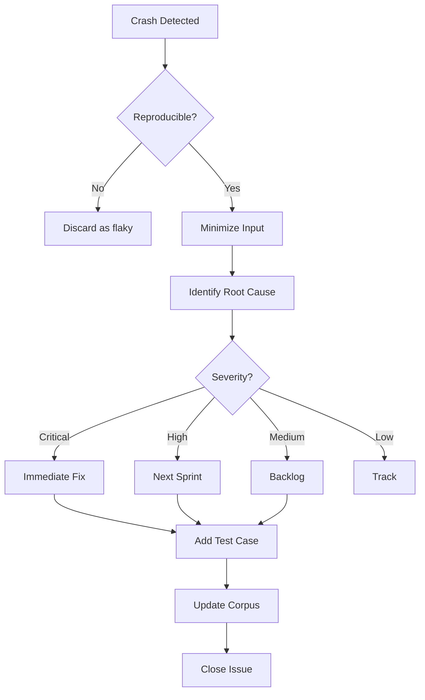

# Comprehensive Fuzzing Strategy for shiplog

## Executive Summary

This document defines a comprehensive fuzzing strategy for all user-controlled inputs in the shiplog project. Fuzzing targets the parsing and processing of external data formats that can cause panics, crashes, or unexpected behavior. The strategy balances finding real bugs with maintaining a sustainable fuzzing program integrated into the development workflow.

## Table of Contents

1. [Primary Fuzzing Targets](#primary-fuzzing-targets)
2. [Fuzz Harness Design](#fuzz-harness-design)
3. [Input Generation Strategy](#input-generation-strategy)
4. [Coverage Analysis](#coverage-analysis)
5. [ROADMAP Feature Integration](#roadmap-feature-integration)
6. [CI/CD Integration](#cicd-integration)
7. [Implementation Roadmap](#implementation-roadmap)

---

## Primary Fuzzing Targets

### 1. JSONL Ingestion (ledger.events.jsonl)

**Location:** [`crates/shiplog-ingest-json/src/lib.rs`](../crates/shiplog-ingest-json/src/lib.rs:31)

**Input Format:** Newline-delimited JSON (JSONL) where each line is a serialized [`EventEnvelope`](../crates/shiplog-schema/src/event.rs:162)

**Attack Surface:**
- Serde JSON deserialization
- Line-by-line parsing with error context
- Empty line handling
- Malformed JSON recovery
- Unicode and encoding issues
- Numeric overflow in timestamps and IDs
- String field length limits
- Nested structure validation

**Critical Code Paths:**
```rust
// crates/shiplog-ingest-json/src/lib.rs:31-43
fn read_events(path: &PathBuf) -> Result<Vec<EventEnvelope>>
```

**Priority:** HIGH - Primary user-facing data format

---

### 2. YAML Workstream Edits (workstreams.yaml)

**Location:** [`crates/shiplog-workstreams/src/lib.rs`](../crates/shiplog-workstreams/src/lib.rs:93)

**Input Format:** YAML serialization of [`WorkstreamsFile`](../crates/shiplog-schema/src/workstream.rs:37)

**Attack Surface:**
- Serde YAML deserialization
- Anchor/alias cycles
- Tag resolution
- Numeric type ambiguity
- Null handling
- Unicode in identifiers
- List truncation logic
- Event ID reference validation

**Critical Code Paths:**
```rust
// crates/shiplog-workstreams/src/lib.rs:93-97
let ws: WorkstreamsFile = serde_yaml::from_str(&text)
```

**Priority:** HIGH - User-curated input, directly affects output

---

### 3. GitHub API Responses

**Location:** [`crates/shiplog-ingest-github/src/lib.rs`](../crates/shiplog-ingest-github/src/lib.rs:108)

**Input Format:** JSON responses from GitHub API (PRs, reviews, search results)

**Attack Surface:**
- Serde JSON deserialization of API types
- Null field handling
- Unexpected enum variants
- Pagination edge cases
- Rate limit error responses
- Malformed datetime strings
- Repository visibility variants
- Actor ID overflow

**Critical Code Paths:**
```rust
// crates/shiplog-ingest-github/src/lib.rs:108-137
fn get_json<T: DeserializeOwned>(&self, client: &Client, url: &str, params: &[(&str, String)])
```

**Priority:** MEDIUM - External API, but responses are controlled by GitHub

---

### 4. Configuration Files (shiplog.yaml)

**Location:** [`apps/shiplog/src/main.rs`](../apps/shiplog/src/main.rs:20)

**Input Format:** YAML configuration for CLI settings and bundle profiles

**Attack Surface:**
- Serde YAML deserialization
- Environment variable substitution
- Path traversal validation
- Profile enum validation
- Numeric bounds checking
- Boolean parsing ambiguity

**Critical Code Paths:**
```rust
// apps/shiplog/src/main.rs:20-26
#[derive(Parser, Debug)]
struct Cli
```

**Priority:** MEDIUM - User configuration, but limited attack surface

---

### 5. Template Files (Jinja2 Templates)

**Location:** [`crates/shiplog-render-md/src/lib.rs`](../crates/shiplog-render-md/src/lib.rs:24)

**Input Format:** Markdown with variable interpolation (future feature)

**Attack Surface:**
- Template injection
- Variable name validation
- Loop bounds checking
- Conditional expression parsing
- Filter function validation
- Escape sequence handling

**Critical Code Paths:**
```rust
// crates/shiplog-render-md/src/lib.rs:24-32
fn render_packet_markdown(...)
```

**Priority:** LOW - Not yet implemented, planned for ROADMAP

---

### 6. Manual Events YAML (manual_events.yaml)

**Location:** [`crates/shiplog-ingest-manual/src/lib.rs`](../crates/shiplog-ingest-manual/src/lib.rs:128)

**Input Format:** YAML serialization of [`ManualEventsFile`](../crates/shiplog-schema/src/event.rs:366)

**Attack Surface:**
- Serde YAML deserialization
- Date range validation
- ManualEventType enum parsing
- URL validation in receipts
- Unicode in descriptions
- Tag list processing

**Critical Code Paths:**
```rust
// crates/shiplog-ingest-manual/src/lib.rs:128-134
pub fn read_manual_events(path: &Path) -> Result<ManualEventsFile>
```

**Priority:** HIGH - User-curated input

---

### 7. Coverage Manifest JSON (coverage.manifest.json)

**Location:** [`crates/shiplog-ingest-json/src/lib.rs`](../crates/shiplog-ingest-json/src/lib.rs:45)

**Input Format:** JSON serialization of [`CoverageManifest`](../crates/shiplog-schema/src/coverage.rs:40)

**Attack Surface:**
- Serde JSON deserialization
- Date parsing (NaiveDate)
- Completeness enum validation
- Slice count validation
- Warning string handling

**Critical Code Paths:**
```rust
// crates/shiplog-ingest-json/src/lib.rs:45-49
fn read_coverage(path: &PathBuf) -> Result<CoverageManifest>
```

**Priority:** MEDIUM - Machine-generated, but user can modify

---

### 8. Bundle Manifest JSON

**Location:** [`crates/shiplog-schema/src/bundle.rs`](../crates/shiplog-schema/src/bundle.rs:55)

**Input Format:** JSON serialization of [`BundleManifest`](../crates/shiplog-schema/src/bundle.rs:55)

**Attack Surface:**
- Serde JSON deserialization
- BundleProfile enum validation
- SHA256 checksum validation
- File path validation
- RunId parsing

**Critical Code Paths:**
```rust
// crates/shiplog-schema/src/bundle.rs:55-62
pub struct BundleManifest
```

**Priority:** MEDIUM - Internal format, but user can modify

---

### 9. Redaction Alias Cache JSON

**Location:** [`crates/shiplog-redact/src/lib.rs`](../crates/shiplog-redact/src/lib.rs:72)

**Input Format:** JSON serialization of [`AliasCache`](../crates/shiplog-redact/src/lib.rs:37)

**Attack Surface:**
- Serde JSON deserialization
- Version field validation
- BTreeMap key/value handling
- Alias string format validation

**Critical Code Paths:**
```rust
// crates/shiplog-redact/src/lib.rs:72-89
pub fn load_cache(&self, path: &Path) -> Result<()>
```

**Priority:** MEDIUM - Internal format, but user can modify

---

## Fuzz Harness Design

### Harness 1: JSONL Event Parsing

**Target:** [`EventEnvelope`](../crates/shiplog-schema/src/event.rs:162) deserialization

**Harness Signature:**
```rust
#![no_main]
use libfuzzer_sys::fuzz_target;

fuzz_target!(|data: &[u8]| {
    // Convert bytes to string, ignore invalid UTF-8 (handled error)
    if let Ok(text) = std::str::from_utf8(data) {
        for line in text.lines() {
            if line.trim().is_empty() {
                continue; // Skip empty lines as production code does
            }
            
            // This should never panic - return Result instead
            let _ = serde_json::from_str::<shiplog_schema::event::EventEnvelope>(line);
        }
    }
});
```

**Input Format:** Raw bytes representing a JSONL file

**Crash vs Handled Error:**
- **Crash/Panic:** Any panic indicates a bug
- **Handled Error:** `Result::Err` is expected and acceptable
- **Expected Crashes:** None - all errors should be handled

**Corpus Seeding:**
1. Valid events from [`examples/fixture/ledger.events.jsonl`](../examples/fixture/ledger.events.jsonl:1)
2. Each event type variant (PullRequest, Review, Manual)
3. Edge cases: empty strings, null fields, large numbers
4. Backward compatibility formats (PascalCase variants)

---

### Harness 2: YAML Workstream Parsing

**Target:** [`WorkstreamsFile`](../crates/shiplog-schema/src/workstream.rs:37) deserialization

**Harness Signature:**
```rust
#![no_main]
use libfuzzer_sys::fuzz_target;

fuzz_target!(|data: &[u8]| {
    if let Ok(text) = std::str::from_utf8(data) {
        let _ = serde_yaml::from_str::<shiplog_schema::workstream::WorkstreamsFile>(text);
    }
});
```

**Input Format:** Raw bytes representing YAML

**Crash vs Handled Error:**
- **Crash/Panic:** Stack overflow from anchor cycles, panic in deserialization
- **Handled Error:** `Result::Err` for malformed YAML
- **Expected Crashes:** Stack overflow from YAML anchor cycles (should be caught by libFuzzer timeout)

**Corpus Seeding:**
1. Valid workstreams.yaml examples
2. Workstreams with empty lists
3. Workstreams with maximum receipt counts
4. Workstreams with various tag combinations

---

### Harness 3: GitHub API Response Parsing

**Target:** GitHub API JSON response types

**Harness Signature:**
```rust
#![no_main]
use libfuzzer_sys::fuzz_target;

fuzz_target!(|data: &[u8]| {
    if let Ok(text) = std::str::from_utf8(data) {
        // Fuzz all GitHub API response types
        let _ = serde_json::from_str::<shiplog_ingest_github::PullRequest>(text);
        let _ = serde_json::from_str::<shiplog_ingest_github::Review>(text);
        let _ = serde_json::from_str::<shiplog_ingest_github::SearchResponse>(text);
    }
});
```

**Input Format:** Raw bytes representing JSON

**Crash vs Handled Error:**
- **Crash/Panic:** Any panic in deserialization
- **Handled Error:** `Result::Err` for malformed JSON or unexpected types
- **Expected Crashes:** None

**Corpus Seeding:**
1. Real GitHub API responses (captured from cache)
2. Responses with all null fields
3. Responses with unexpected enum values
4. Rate limit error responses

---

### Harness 4: Manual Events YAML Parsing

**Target:** [`ManualEventsFile`](../crates/shiplog-schema/src/event.rs:366) deserialization

**Harness Signature:**
```rust
#![no_main]
use libfuzzer_sys::fuzz_target;

fuzz_target!(|data: &[u8]| {
    if let Ok(text) = std::str::from_utf8(data) {
        let _ = serde_yaml::from_str::<shiplog_schema::event::ManualEventsFile>(text);
    }
});
```

**Input Format:** Raw bytes representing YAML

**Crash vs Handled Error:**
- **Crash/Panic:** Stack overflow, panic in deserialization
- **Handled Error:** `Result::Err` for malformed YAML
- **Expected Crashes:** Stack overflow from anchor cycles

**Corpus Seeding:**
1. Valid manual_events.yaml examples
2. All ManualEventType variants
3. Single dates and date ranges
4. Empty receipts and links lists

---

### Harness 5: Coverage Manifest JSON Parsing

**Target:** [`CoverageManifest`](../crates/shiplog-schema/src/coverage.rs:40) deserialization

**Harness Signature:**
```rust
#![no_main]
use libfuzzer_sys::fuzz_target;

fuzz_target!(|data: &[u8]| {
    if let Ok(text) = std::str::from_utf8(data) {
        let _ = serde_json::from_str::<shiplog_schema::coverage::CoverageManifest>(text);
    }
});
```

**Input Format:** Raw bytes representing JSON

**Crash vs Handled Error:**
- **Crash/Panic:** Date parsing panics, enum parsing panics
- **Handled Error:** `Result::Err` for malformed JSON
- **Expected Crashes:** None

**Corpus Seeding:**
1. Valid coverage.manifest.json examples
2. All Completeness variants
3. Empty and large slice arrays
4. Various warning messages

---

### Harness 6: Bundle Manifest JSON Parsing

**Target:** [`BundleManifest`](../crates/shiplog-schema/src/bundle.rs:55) deserialization

**Harness Signature:**
```rust
#![no_main]
use libfuzzer_sys::fuzz_target;

fuzz_target!(|data: &[u8]| {
    if let Ok(text) = std::str::from_utf8(data) {
        let _ = serde_json::from_str::<shiplog_schema::bundle::BundleManifest>(text);
    }
});
```

**Input Format:** Raw bytes representing JSON

**Crash vs Handled Error:**
- **Crash/Panic:** Any panic in deserialization
- **Handled Error:** `Result::Err` for malformed JSON
- **Expected Crashes:** None

**Corpus Seeding:**
1. Valid bundle manifests
2. All BundleProfile variants
3. Missing optional fields
4. Invalid checksum formats

---

### Harness 7: Redaction Alias Cache Parsing

**Target:** [`AliasCache`](../crates/shiplog-redact/src/lib.rs:37) deserialization

**Harness Signature:**
```rust
#![no_main]
use libfuzzer_sys::fuzz_target;

fuzz_target!(|data: &[u8]| {
    if let Ok(text) = std::str::from_utf8(data) {
        let _ = serde_json::from_str::<shiplog_redact::AliasCache>(text);
    }
});
```

**Input Format:** Raw bytes representing JSON

**Crash vs Handled Error:**
- **Crash/Panic:** Version parsing panic
- **Handled Error:** `Result::Err` for malformed JSON
- **Expected Crashes:** None

**Corpus Seeding:**
1. Valid alias cache files
2. Empty cache
3. Large cache with many entries
4. Invalid version numbers

---

### Harness 8: Source System Deserialization

**Target:** [`SourceSystem`](../crates/shiplog-schema/src/event.rs:12) custom deserializer

**Harness Signature:**
```rust
#![no_main]
use libfuzzer_sys::fuzz_target;

fuzz_target!(|data: &[u8]| {
    if let Ok(text) = std::str::from_utf8(data) {
        let _ = serde_json::from_str::<shiplog_schema::event::SourceSystem>(text);
    }
});
```

**Input Format:** Raw bytes representing JSON

**Crash vs Handled Error:**
- **Crash/Panic:** Map key parsing panic
- **Handled Error:** `Result::Err` for malformed JSON
- **Expected Crashes:** None

**Corpus Seeding:**
1. All known variants (string form)
2. All known variants (object form)
3. Other variant with various strings
4. Multi-key maps (should error, not panic)
5. PascalCase backward compatibility forms

---

### Harness 9: Manual Date Deserialization

**Target:** [`ManualDate`](../crates/shiplog-schema/src/event.rs:398) untagged enum

**Harness Signature:**
```rust
#![no_main]
use libfuzzer_sys::fuzz_target;

fuzz_target!(|data: &[u8]| {
    if let Ok(text) = std::str::from_utf8(data) {
        let _ = serde_yaml::from_str::<shiplog_schema::event::ManualDate>(text);
    }
});
```

**Input Format:** Raw bytes representing YAML

**Crash vs Handled Error:**
- **Crash/Panic:** Date parsing panic
- **Handled Error:** `Result::Err` for malformed YAML
- **Expected Crashes:** None

**Corpus Seeding:**
1. Single date strings
2. Date range objects
3. Invalid date formats
4. Edge case dates (leap years, month boundaries)

---

## Input Generation Strategy

### Dictionary-Based Fuzzing

**Purpose:** Target structured format keywords and field names

**JSON Dictionary:**
```
"id"
"kind"
"PullRequest"
"Review"
"Manual"
"occurred_at"
"actor"
"repo"
"payload"
"type"
"data"
"state"
"Open"
"Closed"
"Merged"
"Unknown"
"visibility"
"Public"
"Private"
"system"
"github"
"json_import"
"local_git"
"manual"
"unknown"
"version"
"generated_at"
"workstreams"
"events"
"receipts"
"title"
"summary"
"tags"
"stats"
"pull_requests"
"reviews"
"manual_events"
```

**YAML Dictionary:**
```
version: 1
generated_at:
workstreams:
- id:
  title:
  summary:
  tags:
  stats:
  events:
  receipts:
```

**Coverage Dictionary:**
```
run_id:
user:
window:
since:
until:
mode:
sources:
slices:
query:
total_count:
fetched:
incomplete_results:
notes:
warnings:
completeness:
Complete
Partial
Unknown
```

---

### Grammar-Based Fuzzing

**Purpose:** Generate structurally valid inputs for JSON and YAML

**JSON Grammar for EventEnvelope:**
```
EventEnvelope ::= '{' Field* '}'
Field ::= 'id' ':' String
       | 'kind' ':' EventKind
       | 'occurred_at' ':' DateTime
       | 'actor' ':' Actor
       | 'repo' ':' RepoRef
       | 'payload' ':' EventPayload
       | 'tags' ':' Array
       | 'links' ':' Array
       | 'source' ':' SourceRef
EventKind ::= '"PullRequest"' | '"Review"' | '"Manual"'
DateTime ::= '"' ISO8601 '"'
Actor ::= '{' 'login' ':' String (',' 'id' ':' Number)? '}'
RepoRef ::= '{' 'full_name' ':' String (',' 'html_url' ':' String)? (',' 'visibility' ':' RepoVisibility)? '}'
```

**YAML Grammar for WorkstreamsFile:**
```
WorkstreamsFile ::= 'version:' Number '\n' 'generated_at:' DateTime '\n' 'workstreams:' '\n' WorkstreamList
WorkstreamList ::= ('- ' Workstream '\n')*
Workstream ::= 'id:' String '\n' 'title:' String '\n' ('summary:' String '\n')? 'tags:' '\n' TagList
TagList ::= ('- ' String '\n')*
```

**Implementation:** Use `cargo-fuzz` with custom mutator or integrate with `libFuzzer`'s dictionary support

---

### Mutation-Based Fuzzing

**Purpose:** Evolve existing valid inputs to find edge cases

**Mutation Operators:**
1. **Bit flip:** Randomly flip bits in the input
2. **Byte insertion/insertion:** Add or remove random bytes
3. **Splice:** Combine parts of two corpus inputs
4. **Dictionary insertion:** Insert dictionary terms at random positions
5. **Value replacement:** Replace numbers/strings with edge values
6. **Structure duplication:** Duplicate JSON objects or YAML mappings
7. **Null injection:** Replace values with null
8. **Type confusion:** Replace string with number, array with object

**Specialized Mutations:**
- **Date edge cases:** 1970-01-01, 9999-12-31, leap seconds
- **Numeric overflow:** i64::MAX, u64::MAX, negative numbers
- **String length:** Empty strings, 1MB strings, Unicode sequences
- **Array bounds:** Empty arrays, 100,000 element arrays
- **Nesting depth:** 1000-level nested objects

---

### Cross-Format Fuzzing

**Purpose:** Find parsers that don't validate input format

**Strategies:**
1. **JSON as YAML:** Feed JSON to YAML parsers
2. **YAML as JSON:** Feed YAML to JSON parsers
3. **JSONL as JSON:** Feed multi-line JSONL to single JSON parser
4. **Partial inputs:** Truncate valid inputs mid-structure
5. **Mixed formats:** Concatenate JSON and YAML

**Expected Findings:**
- Parsers accepting wrong formats
- Incomplete error messages
- Silent data corruption

---

## Coverage Analysis

### Code Paths to Exercise

#### JSONL Ingestion
- Valid event parsing (all event types)
- Malformed JSON on each line
- Empty lines handling
- Unicode and surrogate pairs
- Large numeric values
- Missing optional fields
- Unknown enum variants
- Backward compatibility formats

#### YAML Workstreams
- Valid workstreams file
- Anchor/alias cycles
- Empty workstreams list
- Maximum receipt count (10)
- Event ID references
- Missing optional fields
- Numeric type ambiguity (int vs string)
- Tag list processing

#### GitHub API Responses
- All PR states (open, closed, merged)
- Review states (approved, changes_requested, commented)
- Null vs missing fields
- Unexpected API versions
- Pagination edge cases
- Rate limit responses
- Repository visibility variants

#### Manual Events
- All ManualEventType variants
- Single dates vs date ranges
- Date window filtering
- Empty descriptions
- URL validation in receipts
- Tag processing

#### Coverage Manifest
- All Completeness variants
- Empty vs populated slices
- Slice count validation
- Warning message handling
- Date parsing edge cases

#### Bundle Manifest
- All BundleProfile variants
- Missing optional fields
- SHA256 checksum validation
- File path validation
- RunId parsing

#### Redaction Cache
- Version validation
- Empty vs populated cache
- Alias string format
- Large cache performance

---

### Edge Cases and Malformed Inputs

**Common Patterns:**
1. **Null vs Missing:** Distinguish between `null` and absent fields
2. **Empty Collections:** Empty arrays, empty strings, empty objects
3. **Type Confusion:** String where number expected, etc.
4. **Numeric Edge Cases:** Zero, negative, overflow, underflow
5. **Date Edge Cases:** Leap years, month boundaries, time zones
6. **Unicode Edge Cases:** Surrogate pairs, combining marks, invalid UTF-8
7. **Nesting Depth:** Deeply nested structures
8. **Collection Size:** Very large arrays/maps
9. **Duplicate Keys:** JSON objects with duplicate keys (undefined behavior)
10. **Trailing Commas:** JSON with trailing commas (invalid but common)

**Format-Specific Cases:**

**JSONL:**
- Empty file
- File with only newlines
- Line with only whitespace
- Mid-line truncation
- BOM prefix

**YAML:**
- Anchor/alias cycles
- Tag resolution conflicts
- Numeric type ambiguity (1.0 vs 1)
- Null representations (~, null, Null)
- Multi-line strings
- Flow vs block style

**GitHub API:**
- Unexpected enum values
- New fields added by GitHub
- Deprecated fields
- Pagination beyond API limits
- Search result caps

---

### Integration with Existing Test Fixtures

**Fixture Location:** [`examples/fixture/`](../examples/fixture/)

**Integration Strategy:**
1. **Seed Corpus:** Copy all fixture files to fuzz corpus directories
2. **Snapshot Tests:** Use existing snapshot outputs as expected results
3. **Property Tests:** Fuzzing complements property-based testing in [`plans/property-testing-strategy.md`](./property-testing-strategy.md)

**Corpus Structure:**
```
fuzz/
├── corpus/
│   ├── jsonl_events/
│   │   ├── valid_pr.jsonl
│   │   ├── valid_review.jsonl
│   │   ├── mixed_events.jsonl
│   │   └── edge_cases/
│   ├── yaml_workstreams/
│   │   ├── valid.yaml
│   │   ├── empty_workstreams.yaml
│   │   └── max_receipts.yaml
│   ├── github_api/
│   │   ├── pull_request.json
│   │   ├── review.json
│   │   └── search_response.json
│   ├── manual_events/
│   │   ├── all_types.yaml
│   │   ├── date_ranges.yaml
│   │   └── empty.yaml
│   ├── coverage_manifest/
│   │   ├── complete.json
│   │   ├── partial.json
│   │   └── empty_slices.json
│   ├── bundle_manifest/
│   │   ├── internal.json
│   │   ├── manager.json
│   │   └── public.json
│   └── redaction_cache/
│       ├── populated.json
│       └── empty.json
├── crashes/  # Auto-generated by libFuzzer
└── artifacts/  # Auto-generated by libFuzzer
```

---

### Metrics for Measuring Fuzzing Effectiveness

**Code Coverage Metrics:**
1. **Line Coverage:** Percentage of lines executed during fuzzing
2. **Branch Coverage:** Percentage of conditional branches taken
3. **Function Coverage:** Percentage of functions called
4. **Edge Coverage:** Unique edge pairs in control flow graph

**Fuzzing-Specific Metrics:**
1. **Corpus Size:** Number of unique inputs in corpus
2. **Execution Count:** Total number of harness executions
3. **Execution Rate:** Executions per second
4. **Unique Crashes:** Number of distinct crash-causing inputs
5. **Crash Reduction:** Crashes fixed over time
6. **Coverage Growth:** New coverage gained per time period

**Quality Metrics:**
1. **Bug Density:** Bugs found per KLOC
2. **Crash Severity:** Distribution of crash types (panic, assertion, UB)
3. **False Positive Rate:** Crashes that are not actual bugs
4. **Fix Time:** Time from crash discovery to fix

**Tooling:**
- `cargo-llvm-cov` for coverage reports
- `cargo-fuzz` built-in statistics
- Custom scripts for trend analysis

---

## ROADMAP Feature Integration

### GitLab API Responses (v0.3.x)

**Fuzz Target:** GitLab merge request and review JSON responses

**Harness Design:**
```rust
fuzz_target!(|data: &[u8]| {
    if let Ok(text) = std::str::from_utf8(data) {
        let _ = serde_json::from_str::<shiplog_ingest_gitlab::MergeRequest>(text);
        let _ = serde_json::from_str::<shiplog_ingest_gitlab::Review>(text);
    }
});
```

**Input Generation:**
- Dictionary with GitLab-specific fields (iid, web_url, author)
- Grammar for GitLab API response structure
- Corpus from real GitLab API responses

**Edge Cases:**
- Self-hosted GitLab variants
- GitLab-specific states (opened, closed, merged, locked)
- Different API versions

---

### Jira/Linear API Responses (v0.3.x)

**Fuzz Target:** Jira and Linear issue/ticket JSON responses

**Harness Design:**
```rust
fuzz_target!(|data: &[u8]| {
    if let Ok(text) = std::str::from_utf8(data) {
        let _ = serde_json::from_str::<shiplog_ingest_jira::Issue>(text);
        let _ = serde_json::from_str::<shiplog_ingest_linear::Ticket>(text);
    }
});
```

**Input Generation:**
- Dictionary with Jira/Linear field names
- Grammar for issue/ticket structure
- Corpus from real API responses

**Edge Cases:**
- Custom field types
- Rich text descriptions
- Attachment metadata

---

### Multi-Source Merge Inputs (v0.3.x)

**Fuzz Target:** Event merging logic from multiple sources

**Harness Design:**
```rust
fuzz_target!(|data: &[u8]| {
    if let Ok(text) = std::str::from_utf8(data) {
        // Parse multiple events from input
        let events: Vec<EventEnvelope> = serde_json::from_str(text).unwrap_or_default();
        let _ = shiplog_engine::merge_events(events);
    }
});
```

**Input Generation:**
- Grammar for event arrays
- Mutation of existing event sets
- Cross-source event combinations

**Edge Cases:**
- Duplicate event IDs
- Conflicting timestamps
- Different source systems for same event

---

### Plugin System Inputs (Later)

**Fuzz Target:** Plugin configuration and data inputs

**Harness Design:**
```rust
fuzz_target!(|data: &[u8]| {
    if let Ok(text) = std::str::from_utf8(data) {
        let _ = serde_yaml::from_str::<shiplog_plugin::PluginConfig>(text);
    }
});
```

**Input Generation:**
- Dictionary for plugin-specific fields
- Grammar for plugin manifest
- Corpus from community plugins

**Edge Cases:**
- Malicious plugin manifests
- Plugin version conflicts
- Invalid plugin paths

---

### Configurable Packet Templates (v0.3.x)

**Fuzz Target:** Jinja2-like template syntax

**Harness Design:**
```rust
fuzz_target!(|data: &[u8]| {
    if let Ok(text) = std::str::from_utf8(data) {
        let _ = shiplog_template::parse_template(text);
    }
});
```

**Input Generation:**
- Dictionary for template keywords (for, if, endif, endfor)
- Grammar for template syntax
- Corpus from user templates

**Edge Cases:**
- Unclosed blocks
- Infinite loops
- Variable name conflicts
- Filter injection

---

## CI/CD Integration

### Continuous Fuzzing Strategy

**Approach:** Two-tier fuzzing for balance between thoroughness and CI resources

**Tier 1: CI Fuzzing (Fast)**
- **Duration:** 30 seconds per harness
- **Triggers:** Every PR, every merge to main
- **Purpose:** Catch regressions quickly
- **Resources:** Single CPU core, 512MB RAM

**Tier 2: Nightly Fuzzing (Thorough)**
- **Duration:** 4 hours per harness
- **Triggers:** Nightly cron job
- **Purpose:** Find deep bugs, grow corpus
- **Resources:** Multiple CPU cores, 2GB RAM

**GitHub Actions Workflow:**
```yaml
name: Fuzzing

on:
  pull_request:
  push:
    branches: [main]
  schedule:
    - cron: '0 2 * * *'  # Daily at 2 AM UTC

jobs:
  fuzz-ci:
    runs-on: ubuntu-latest
    timeout-minutes: 10
    steps:
      - uses: actions/checkout@v4
      - uses: actions-rs/toolchain@v1
        with:
          toolchain: stable
      - run: cargo install cargo-fuzz
      - run: cargo fuzz run parse_event -- -max_total_time=30
      - run: cargo fuzz run parse_workstreams -- -max_total_time=30
      # ... other harnesses

  fuzz-nightly:
    runs-on: ubuntu-latest
    if: github.event_name == 'schedule'
    timeout-minutes: 360
    steps:
      - uses: actions/checkout@v4
      - uses: actions-rs/toolchain@v1
        with:
          toolchain: stable
      - run: cargo install cargo-fuzz
      - run: cargo fuzz run parse_event -- -max_total_time=14400
      - run: cargo fuzz run parse_workstreams -- -max_total_time=14400
      # ... other harnesses
      - name: Upload corpus
        uses: actions/upload-artifact@v4
        with:
          name: fuzz-corpus
          path: fuzz/corpus/
```

---

### Corpus Management and Minimization

**Corpus Storage:**
- **Location:** `fuzz/corpus/` in repository
- **Version Control:** Track minimal corpus in git
- **Artifacts:** Store full corpus in CI artifacts

**Minimization Strategy:**
1. **Automatic Minimization:** Use `cargo fuzz cmin` to minimize corpus
2. **Manual Review:** Periodically review corpus for redundant inputs
3. **Deduplication:** Remove inputs that don't increase coverage
4. **Categorization:** Organize corpus by feature/edge case

**Corpus Update Workflow:**
```bash
# After nightly fuzzing
cargo fuzz cmin parse_event
cargo fuzz tmin parse_event fuzz/corpus/parse_event/crash-*

# Review and commit minimized corpus
git add fuzz/corpus/
git commit -m "fuzz: minimize corpus for parse_event"
```

**Corpus Metrics:**
- Track corpus size over time
- Monitor coverage per input
- Identify redundant inputs
- Prioritize high-impact inputs

---

### Crash Triage Workflow

**Crash Discovery:**
1. **CI Detection:** Fuzzing fails in CI
2. **Local Reproduction:** Developer reproduces crash locally
3. **Minimization:** Use `cargo fuzz tmin` to minimize crash input
4. **Categorization:** Classify crash severity and type

**Crash Categories:**
1. **Critical:** Panic, assertion failure, undefined behavior
2. **High:** Logic error, incorrect output
3. **Medium:** Performance issue, memory leak
4. **Low:** Cosmetic issue, poor error message

**Triage Process:**


**Issue Template:**
```markdown
## Fuzzing Crash Report

### Harness
- Harness name: `parse_event`
- Input: [Attached]

### Crash Details
- Error: `panic at ...`
- Backtrace: [Attached]

### Minimized Input
```json
{...}
```

### Root Cause
[Brief description]

### Severity
- [ ] Critical
- [ ] High
- [ ] Medium
- [ ] Low

### Fix
[Link to PR]
```

---

### Performance Monitoring

**Metrics to Track:**
1. **Fuzzing Throughput:** Executions per second per harness
2. **Coverage Growth:** New coverage per fuzzing session
3. **Crash Rate:** Crashes found per time period
4. **Corpus Size:** Growth trend of corpus
5. **CI Duration:** Time for fuzzing in CI

**Dashboard:**
- GitHub Actions summary
- Custom metrics page
- Historical trends
- Comparison charts

**Alerting:**
- New critical crashes: Immediate notification
- Coverage regression: Warning
- CI timeout: Investigation required
- Performance degradation: Monitor

**Performance Targets:**
- CI fuzzing: < 10 minutes total
- Nightly fuzzing: 4 hours per harness
- Coverage: > 80% for critical code paths
- Crash rate: < 1 new crash per week

---

## Implementation Roadmap

### Phase 1: Core Fuzzing (Week 1-2)

**Goals:** Implement fuzzing for primary targets

**Tasks:**
- [ ] Set up `cargo-fuzz` infrastructure
- [ ] Implement `parse_event` harness (JSONL)
- [ ] Implement `parse_workstreams` harness (YAML)
- [ ] Seed corpus with fixture files
- [ ] Configure CI for fast fuzzing
- [ ] Document fuzzing setup

**Deliverables:**
- Working fuzz harnesses for JSONL and YAML
- CI integration with 30-second fuzzing
- Initial corpus from fixtures

---

### Phase 2: Extended Fuzzing (Week 3-4)

**Goals:** Add harnesses for remaining targets

**Tasks:**
- [ ] Implement `parse_manual_events` harness
- [ ] Implement `parse_coverage` harness
- [ ] Implement `parse_bundle` harness
- [ ] Implement `parse_redaction_cache` harness
- [ ] Implement `parse_source_system` harness
- [ ] Implement `parse_manual_date` harness
- [ ] Create dictionaries for all formats
- [ ] Add grammar-based fuzzing support

**Deliverables:**
- 8 total fuzz harnesses
- Comprehensive dictionaries
- Grammar definitions

---

### Phase 3: Advanced Fuzzing (Week 5-6)

**Goals:** Improve fuzzing effectiveness

**Tasks:**
- [ ] Implement GitHub API harness
- [ ] Add mutation operators
- [ ] Implement cross-format fuzzing
- [ ] Set up nightly fuzzing
- [ ] Implement corpus minimization
- [ ] Create crash triage workflow
- [ ] Set up performance monitoring

**Deliverables:**
- Nightly fuzzing pipeline
- Automated corpus management
- Crash triage process

---

### Phase 4: ROADMAP Integration (Ongoing)

**Goals:** Add fuzzing for new features

**Tasks:**
- [ ] GitLab API fuzzing (when implemented)
- [ ] Jira/Linear fuzzing (when implemented)
- [ ] Multi-source merge fuzzing (when implemented)
- [ ] Template parsing fuzzing (when implemented)
- [ ] Plugin system fuzzing (when implemented)

**Deliverables:**
- Fuzz harnesses for all new features
- Updated dictionaries and grammars

---

### Phase 5: Maintenance (Ongoing)

**Goals:** Sustain fuzzing program

**Tasks:**
- [ ] Weekly corpus review
- [ ] Monthly coverage analysis
- [ ] Quarterly dictionary updates
- [ ] Crash triage and fixing
- [ ] Documentation updates
- [ ] Team training on fuzzing

**Deliverables:**
- Sustained fuzzing program
- Growing corpus
- Reducing crash rate

---

## Appendix A: Fuzzing Best Practices

### Do's
1. **Start small:** Begin with one harness, add more gradually
2. **Seed well:** Use real-world inputs for initial corpus
3. **Minimize crashes:** Always minimize crash inputs before fixing
4. **Track coverage:** Monitor coverage growth over time
5. **Document everything:** Document harnesses, dictionaries, and findings
6. **Fix fast:** Prioritize critical crashes
7. **Review regularly:** Periodically review corpus and results

### Don'ts
1. **Don't ignore crashes:** Even "minor" crashes indicate bugs
2. **Don't over-optimize:** Focus on finding bugs, not maximizing coverage
3. **Don't skip CI:** Keep fuzzing in CI to catch regressions
4. **Don't forget dictionaries:** Dictionaries dramatically improve effectiveness
5. **Don't rely solely on fuzzing:** Combine with unit tests, integration tests, and property tests

---

## Appendix B: Tooling References

**Primary Tools:**
- `cargo-fuzz`: Rust fuzzing framework based on libFuzzer
- `libFuzzer`: LLVM-based coverage-guided fuzzer
- `cargo-llvm-cov`: Code coverage reporting for Rust

**Additional Tools:**
- `afl-rs`: American Fuzzy Lop for Rust
- `honggfuzz-rs`: Honggfuzz for Rust
- `cargo-tarpaulin`: Alternative coverage tool

**Documentation:**
- [cargo-fuzz book](https://rust-fuzz.github.io/book/cargo-fuzz.html)
- [libFuzzer documentation](https://llvm.org/docs/LibFuzzer.html)
- [Rust fuzzing tutorial](https://rust-fuzz.github.io/book/)

---

## Appendix C: Fuzzing Terminology

| Term | Definition |
|------|------------|
| **Harness** | Entry point function that accepts fuzz input |
| **Corpus** | Collection of interesting inputs |
| **Dictionary** | List of keywords/strings to guide fuzzing |
| **Mutation** | Modification of an input to create new inputs |
| **Coverage** | Measure of code executed during fuzzing |
| **Crash** | Input that causes a panic or undefined behavior |
| **Minimization** | Reducing a crash input to its minimal form |
| **Cmin** | Corpus minimization - removing redundant inputs |
| **Tmin** | Test case minimization - reducing crash input |
| **Seed** | Initial input provided to fuzzer |

---

## Appendix D: Related Documents

- [`plans/property-testing-strategy.md`](./property-testing-strategy.md) - Property-based testing strategy
- [`plans/bdd-scenarios-design.md`](./bdd-scenarios-design.md) - BDD scenario design
- [`ROADMAP.md`](../ROADMAP.md) - Project roadmap
- [`fuzz/README.md`](../fuzz/README.md) - Existing fuzzing scaffolding

---

## Conclusion

This fuzzing strategy provides a comprehensive approach to finding bugs in user-controlled input parsing across the shiplog project. By implementing the harnesses, dictionaries, and CI integration outlined here, the project will have a sustainable fuzzing program that complements other testing approaches and helps ensure robustness of all input surfaces.

The strategy balances thoroughness with practicality, using tiered fuzzing (fast CI + thorough nightly) and focusing on the most critical input surfaces first. As new features are added to the ROADMAP, the fuzzing program can be extended to cover them, maintaining a strong security and reliability posture throughout the project's evolution.
