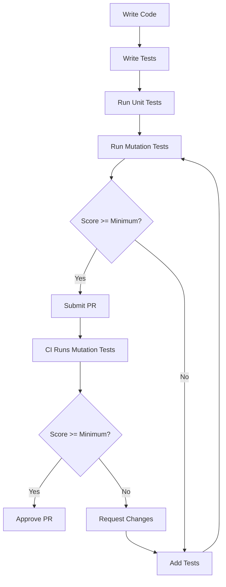

# Mutation Testing Strategy for shiplog

**Version:** 1.0  
**Status:** Design Document  
**Author:** Architect Team  
**Date:** 2025-02-17

---

## Executive Summary

This document outlines a comprehensive mutation testing strategy for the shiplog project. Mutation testing is a fault-based testing technique that introduces small changes (mutations) to source code and verifies whether existing tests detect these changes. A mutation score measures the percentage of mutants that are "killed" by the test suite, providing a direct indicator of test quality.

The current [`cargo-mutants.toml`](../cargo-mutants.toml) configuration is minimal, with only basic timeout and exclusion settings. This strategy establishes a systematic approach to implementing meaningful mutation testing across all 16 crates in the shiplog workspace.

---

## 1. Mutation Testing Strategy

### 1.1 Goals and Objectives

**Primary Goals:**

1. **Validate Test Quality:** Ensure tests genuinely verify code behavior rather than merely passing through existing implementations.
2. **Identify Test Gaps:** Discover untested code paths and edge cases that traditional coverage metrics miss.
3. **Prevent Regression:** Establish a baseline for mutation scores that must be maintained or improved.
4. **Support Refactoring Confidence:** Provide assurance that refactoring doesn't inadvertently weaken test effectiveness.
5. **Guide Test Development:** Use mutation results to prioritize where additional tests are needed.

**Secondary Goals:**

1. **Educational Value:** Help developers understand what constitutes effective tests.
2. **Documentation of Invariants:** Mutation testing reveals implicit invariants that should be made explicit.
3. **Redaction Safety Verification:** Specifically validate that redaction invariants are not paper-thin.

### 1.2 Mutation Operators

cargo-mutants supports several mutation operators. The following operators will be applied:

| Operator | Description | Priority |
|----------|-------------|----------|
| `replace_bool` | Replace `true` with `false` and vice versa | High |
| `replace_int` | Replace integer literals with other values | High |
| `replace_match` | Swap match arms | High |
| `replace_pattern` | Modify pattern matching | High |
| `replace_operator` | Replace binary operators (e.g., `+` with `-`) | Medium |
| `remove_statement` | Remove statements | Medium |
| `remove_item` | Remove function items | Low (use with caution) |
| `replace_trait_method` | Replace trait method implementations | Medium |

**Operator Selection Rationale:**

- **High Priority:** Boolean and integer mutations are most likely to reveal logic errors in conditional branches.
- **Medium Priority:** Match and operator mutations test control flow and arithmetic correctness.
- **Low Priority:** Statement removal can produce many equivalent mutants; use selectively.

### 1.3 Crate Prioritization

Based on criticality and complexity, crates are prioritized into tiers:

#### Tier 1: Critical Core (Highest Priority)

These crates contain core data structures and invariants that must be thoroughly tested:

- **[`shiplog-schema`](../crates/shiplog-schema/)**: Canonical event model, coverage tracking, bundle metadata
- **[`shiplog-redact`](../crates/shiplog-redact/)**: Redaction invariants - security-critical
- **[`shiplog-coverage`](../crates/shiplog-coverage/)**: Time window utilities, completeness tracking
- **[`shiplog-ids`](../crates/shiplog-ids/)**: ID generation - must be deterministic

**Target Mutation Score:** ≥ 90%

#### Tier 2: Pipeline Core (High Priority)

These crates implement core pipeline functionality:

- **[`shiplog-engine`](../crates/shiplog-engine/)**: Orchestration engine
- **[`shiplog-bundle`](../crates/shiplog-bundle/)**: Bundle writing and manifest generation
- **[`shiplog-workstreams`](../crates/shiplog-workstreams/)**: Workstream management
- **[`shiplog-ports`](../crates/shiplog-ports/)**: Trait definitions

**Target Mutation Score:** ≥ 80%

#### Tier 3: Adapters and Renderers (Medium Priority)

These crates implement adapters and rendering:

- **[`shiplog-ingest-github`](../crates/shiplog-ingest-github/)**: GitHub API ingestor
- **[`shiplog-ingest-json`](../crates/shiplog-ingest-json/)**: JSON ingestor
- **[`shiplog-ingest-manual`](../crates/shiplog-ingest-manual/)**: Manual event ingestor
- **[`shiplog-render-md`](../crates/shiplog-render-md/)**: Markdown renderer
- **[`shiplog-render-json`](../crates/shiplog-render-json/)**: JSON renderer
- **[`shiplog-cache`](../crates/shiplog-cache/)**: API cache

**Target Mutation Score:** ≥ 70%

#### Tier 4: Supporting and Experimental (Lower Priority)

- **[`shiplog-cluster-llm`](../crates/shiplog-cluster-llm/)**: LLM clustering (feature-gated)
- **[`shiplog-testkit`](../crates/shiplog-testkit/)**: Test utilities (not production code)
- **[`apps/shiplog`](../apps/shiplog/)**: CLI application

**Target Mutation Score:** ≥ 60%

### 1.4 Success Criteria

**Minimum Acceptable Mutation Scores by Tier:**

| Tier | Minimum Score | Target Score |
|------|---------------|--------------|
| Tier 1 (Critical Core) | 85% | 95% |
| Tier 2 (Pipeline Core) | 75% | 85% |
| Tier 3 (Adapters/Renderers) | 65% | 80% |
| Tier 4 (Supporting) | 55% | 70% |

**Overall Success Criteria:**

1. **Baseline Establishment:** All crates must achieve minimum scores within 2 sprints of implementation.
2. **Regression Prevention:** Mutation scores must not decrease by more than 2% between releases without explicit approval.
3. **Trend Improvement:** Target a 5% improvement in overall mutation score over 6 months.
4. **Equivalent Mutant Analysis:** Document and justify all surviving equivalent mutants.
5. **Test Quality:** Surviving non-equivalent mutants must be addressed before release.

---

## 2. Configuration Design

### 2.1 Enhanced cargo-mutants.toml

The enhanced configuration provides per-crate settings and test filtering:

```toml
# Mutation testing configuration for shiplog
#
# Run: cargo mutants --workspace
# Run single crate: cargo mutants -p shiplog-schema
# Run with specific test: cargo mutants -p shiplog-schema -- test_name

[mutants]
# Global timeout per mutation test run
timeout = "120s"

# Maximum number of concurrent mutation jobs
jobs = 4

# Minimum test coverage required before mutation testing
# (requires cargo-llvm-cov)
minimum_coverage = 80

# Output directory for mutation results
output = "target/mutants"

# Generate HTML report
generate_html = true

# Exclude patterns
exclude = [
    "target/**",
    "out/**",
    "examples/**",
    "fuzz/**",
    # Test utilities don't need mutation testing
    "crates/shiplog-testkit/**",
]

# Per-crate configuration
[crates.shiplog-schema]
# Critical core - highest priority
minimum_score = 85
timeout = "180s"
# Focus on core data structures
exclude_files = [
    # Exclude generated code if any
]

[crates.shiplog-schema.mutants]
# Enable all mutation operators for schema
replace_bool = true
replace_int = true
replace_match = true
replace_pattern = true
replace_operator = true

[crates.shiplog-redact]
# Security-critical - highest priority
minimum_score = 90
timeout = "180s"

[crates.shiplog-redact.mutants]
# Focus on boolean mutations for redaction logic
replace_bool = true
replace_match = true
replace_pattern = true

[crates.shiplog-coverage]
# Core utilities - high priority
minimum_score = 85
timeout = "120s"

[crates.shiplog-coverage.mutants]
# Date boundary mutations are critical
replace_int = true
replace_operator = true
replace_bool = true

[crates.shiplog-ids]
# ID generation must be deterministic
minimum_score = 85
timeout = "60s"

[crates.shiplog-ids.mutants]
# Hash mutations are critical
replace_bool = true
replace_int = true

[crates.shiplog-engine]
# Pipeline orchestration
minimum_score = 75
timeout = "180s"

[crates.shiplog-engine.mutants]
replace_bool = true
replace_match = true
# Be conservative with statement removal
remove_statement = false

[crates.shiplog-bundle]
minimum_score = 75
timeout = "120s"

[crates.shiplog-bundle.mutants]
replace_bool = true
replace_match = true

[crates.shiplog-workstreams]
minimum_score = 75
timeout = "120s"

[crates.shiplog-workstreams.mutants]
replace_bool = true
replace_match = true

[crates.shiplog-ingest-github]
# API adapter - network code has different characteristics
minimum_score = 65
timeout = "240s"
# Longer timeout for API calls

[crates.shiplog-ingest-github.mutants]
replace_bool = true
replace_match = true
# Exclude network timeout mutations (often equivalent)
exclude_mutants = [
    "timeout mutations",
]

[crates.shiplog-ingest-json]
minimum_score = 65
timeout = "120s"

[crates.shiplog-ingest-manual]
minimum_score = 65
timeout = "120s"

[crates.shiplog-render-md]
minimum_score = 65
timeout = "120s"

[crates.shiplog-render-md.mutants]
# String formatting mutations often equivalent
replace_bool = true
replace_match = true
exclude_mutants = [
    "string format mutations",
]

[crates.shiplog-render-json]
minimum_score = 65
timeout = "120s"

[crates.shiplog-cache]
minimum_score = 65
timeout = "120s"

[crates.shiplog-cache.mutants]
replace_bool = true
replace_match = true

[crates.shiplog-cluster-llm]
# Feature-gated, lower priority
minimum_score = 55
timeout = "180s"

[crates.shiplog-cluster-llm.mutants]
replace_bool = true
replace_match = true

# Test filtering strategies
[tests]
# Run specific test suites for mutation testing
test_filter = "mutants"

# Alternatively, exclude integration tests for faster runs
# exclude_tests = ["integration", "bdd"]

# Run mutation tests in release mode for better performance
profile = "release"

# Features to enable during mutation testing
features = []
```

### 2.2 Per-Crate Mutation Exclusions and Inclusions

**Exclusion Criteria:**

1. **Generated Code:** Any code generated by macros or build scripts.
2. **Debug/Logging Statements:** Mutations in debug assertions or logging calls.
3. **Performance Optimizations:** Code that doesn't affect correctness.
4. **External API Wrappers:** Thin wrappers around external libraries.
5. **Test Code:** Test utilities and fixtures.

**Inclusion Priorities:**

1. **Business Logic:** Core algorithms and data transformations.
2. **Validation Logic:** Input validation and error checking.
3. **State Transitions:** State machine logic and transitions.
4. **Boundary Conditions:** Edge cases and boundary handling.
5. **Redaction Logic:** All redaction-related code.

### 2.3 Test Filtering Strategies

To balance thoroughness with execution time:

**Strategy 1: Unit Test Focus (Fast)**

```bash
cargo mutants --workspace -- --lib
```

Runs only library tests, excluding integration tests.

**Strategy 2: Per-Crate Targeted (Medium)**

```bash
cargo mutants -p shiplog-schema
cargo mutants -p shiplog-redact
# ... etc
```

Run mutation tests on specific crates during development.

**Strategy 3: Test Suite Segmentation (Comprehensive)**

```bash
# Core invariants
cargo mutants -p shiplog-schema -- --test "mutation_core"

# Redaction safety
cargo mutants -p shiplog-redact -- --test "mutation_redaction"

# Full workspace (nightly/PR)
cargo mutants --workspace
```

**Strategy 4: Incremental (CI-Optimized)**

```bash
# Only test changed crates (requires git integration)
cargo mutants --workspace --files $(git diff --name-only HEAD~1)
```

### 2.4 Timeout and Resource Allocation

**Timeout Settings:**

| Crate Type | Timeout | Rationale |
|------------|---------|-----------|
| Core (schema, redact, coverage, ids) | 180s | Complex logic, many mutations |
| Pipeline (engine, bundle, workstreams) | 180s | Integration-heavy |
| Adapters (ingest-*) | 240s | Network calls, API mocking |
| Renderers | 120s | String operations |
| Cache | 120s | I/O operations |
| LLM cluster | 180s | Feature-gated, async operations |

**Resource Allocation:**

- **Concurrent Jobs:** 4 (default) - balance between speed and resource usage
- **Memory:** 2GB minimum per job for larger crates
- **Disk:** 500MB for mutation output and reports
- **CPU:** Mutation testing is CPU-bound; allocate dedicated runners in CI

---

## 3. Coverage Analysis

### 3.1 Critical Code Paths

The following code paths MUST have mutations killed:

#### shiplog-schema

**Critical Paths:**

1. **EventEnvelope.id generation** - Must be deterministic and unique
2. **CoverageManifest.completeness** - Must accurately reflect data completeness
3. **TimeWindow.contains()** - Boundary conditions are critical
4. **EventPayload serialization** - Round-trip correctness

**Mutation Focus:**

```rust
// Critical: TimeWindow boundary logic
pub fn contains(&self, d: NaiveDate) -> bool {
    d >= self.since && d < self.until  // Mutate >= to >, < to <=
}

// Critical: Completeness tracking
pub enum Completeness {
    Complete,      // Swap with Partial/Unknown
    Partial,
    Unknown,
}
```

#### shiplog-redact

**Critical Paths:**

1. **RedactionProfile application** - Must not leak sensitive data
2. **Alias generation** - Must be stable and deterministic
3. **URL pattern matching** - Must strip all URLs in public mode
4. **Repo name redaction** - Must not leak repository names

**Mutation Focus:**

```rust
// Critical: Redaction profile matching
match profile {
    RedactionProfile::Internal => { /* no redaction */ },
    RedactionProfile::Manager => { /* partial redaction */ },
    RedactionProfile::Public => { /* full redaction */ },  // Swap arms
}

// Critical: URL pattern detection
fn is_url(s: &str) -> bool {
    s.starts_with("http://") || s.starts_with("https://")  // Mutate operators
}
```

#### shiplog-coverage

**Critical Paths:**

1. **Time window splitting** - Month, week, day boundaries
2. **Completeness calculation** - Must correctly identify partial coverage
3. **Slice metadata tracking** - API caps and incomplete results

**Mutation Focus:**

```rust
// Critical: Month boundary calculation
fn next_month_start(d: NaiveDate) -> NaiveDate {
    let (y, m) = (d.year(), d.month());
    let (ny, nm) = if m == 12 { (y + 1, 1) } else { (y, m + 1) };  // Mutate condition
    NaiveDate::from_ymd_opt(ny, nm, 1).unwrap()
}

// Critical: Window iteration
while cursor < until {  // Mutate < to <=
    let next = next_month_start(cursor);
    let end = if next < until { next } else { until };  // Mutate condition
    // ...
}
```

#### shiplog-ids

**Critical Paths:**

1. **EventId deterministic generation** - Same inputs must produce same output
2. **RunId format** - Must follow expected format
3. **WorkstreamId uniqueness** - Must be unique per workstream

**Mutation Focus:**

```rust
// Critical: Hash-based ID generation
pub fn from_parts(parts: &[&str]) -> Self {
    let hash = Sha256::digest(parts.join(":").as_bytes());  // Mutate separator
    Self(hex::encode(hash))
}
```

#### shiplog-engine

**Critical Paths:**

1. **Pipeline orchestration** - Must execute steps in correct order
2. **Workstream source selection** - Must prefer curated over suggested
3. **Output file generation** - Must create all expected files

**Mutation Focus:**

```rust
// Critical: Workstream source preference
match ws_source {
    WorkstreamSource::Curated => WorkstreamManager::curated_path(out_dir),
    WorkstreamSource::Suggested => WorkstreamManager::suggested_path(out_dir),
    // Swap arms to test preference logic
}
```

### 3.2 Current Test Effectiveness Analysis

Based on the 101 tests found across the codebase:

**Test Distribution by Crate:**

| Crate | Test Count | Test Type | Effectiveness Estimate |
|-------|------------|-----------|------------------------|
| shiplog-schema | 14 | Unit | High - good coverage of data structures |
| shiplog-redact | 22 | Unit + Property | High - proptest validates invariants |
| shiplog-coverage | 3 | Unit | Medium - basic boundary tests |
| shiplog-ids | 8 | Unit | High - deterministic tests |
| shiplog-engine | 4 | Integration | Medium - end-to-end tests |
| shiplog-bundle | 11 | Unit | High - file operation tests |
| shiplog-workstreams | 8 | Unit | High - preference logic tests |
| shiplog-ingest-github | 5 | Unit | Medium - API mocking |
| shiplog-ingest-json | 4 | Unit | High - round-trip tests |
| shiplog-ingest-manual | 3 | Unit | Medium - basic tests |
| shiplog-render-md | 5 | Unit + Snapshot | Medium - snapshot tests |
| shiplog-render-json | 5 | Unit | High - round-trip tests |
| shiplog-cache | 6 | Unit | High - cache operations |
| shiplog-cluster-llm | 8 | Unit | Medium - LLM mocking |
| shiplog-testkit | 1 | BDD | N/A - test utilities |
| shiplog-ports | 0 | N/A | N/A - trait definitions |

**Gaps Identified:**

1. **shiplog-coverage:** Only 3 tests - insufficient for boundary condition coverage
2. **shiplog-engine:** Only 4 tests - needs more orchestration scenarios
3. **shiplog-ingest-github:** Limited API error handling tests
4. **shiplog-render-md:** Snapshot tests may miss edge cases
5. **shiplog-ports:** No tests (trait definitions only - acceptable)

### 3.3 Mutation Coverage Gaps

**Anticipated Surviving Mutants:**

1. **shiplog-coverage:** Date boundary mutations may survive if edge cases aren't tested
2. **shiplog-ingest-github:** Network timeout mutations often equivalent
3. **shiplog-render-md:** String formatting mutations often equivalent
4. **shiplog-engine:** Error handling paths may lack tests

**Priority Areas for Test Enhancement:**

1. **Boundary Conditions:** Add tests for date boundaries, empty collections, max values
2. **Error Paths:** Add tests for all error return paths
3. **Edge Cases:** Add tests for unusual inputs (empty strings, special characters, etc.)
4. **State Transitions:** Add tests for state machine transitions
5. **Integration Scenarios:** Add more end-to-end tests

### 3.4 Relationship Between Mutation Score and Test Quality

**Mutation Score Interpretation:**

| Score Range | Interpretation | Action Required |
|-------------|----------------|-----------------|
| 95-100% | Excellent test quality | Maintain current practices |
| 85-94% | Good test quality | Minor improvements needed |
| 75-84% | Acceptable test quality | Address surviving mutants |
| 65-74% | Needs improvement | Significant test additions needed |
| < 65% | Poor test quality | Major test overhaul required |

**Key Insights:**

1. **High Coverage ≠ High Mutation Score:** Line coverage of 100% can still have low mutation scores if tests don't assert on behavior.
2. **Surviving Mutants Reveal Gaps:** Each surviving mutant represents a behavior not verified by tests.
3. **Equivalent Mutants Are Valuable:** Identifying equivalent mutants helps understand code invariants.
4. **Mutation Score Trends Matter:** Improving scores over time indicates maturing test practices.

---

## 4. ROADMAP Feature Integration

### 4.1 Mutation Testing for New Ingest Adapters

**Planned Adapters (from ROADMAP):**

1. **shiplog-ingest-git** (v0.2.x - Now)
2. **shiplog-ingest-gitlab** (v0.3.x - Next)
3. **shiplog-ingest-jira** (v0.3.x - Next)
4. **shiplog-ingest-linear** (v0.3.x - Next)

**Mutation Testing Strategy:**

**Phase 1: Development**

- Write mutation tests alongside unit tests
- Target minimum 70% mutation score before PR approval
- Focus on:
  - API response parsing
  - Date range handling
  - Error handling
  - Event mapping logic

**Phase 2: Integration**

- Add mutation tests to CI pipeline
- Include in workspace mutation testing
- Monitor mutation scores during development

**Configuration for New Adapters:**

```toml
[crates.shiplog-ingest-git]
minimum_score = 70
timeout = "180s"

[crates.shiplog-ingest-gitlab]
minimum_score = 70
timeout = "240s"  # API adapter

[crates.shiplog-ingest-jira]
minimum_score = 70
timeout = "240s"

[crates.shiplog-ingest-linear]
minimum_score = 70
timeout = "240s"
```

**Critical Mutations for Ingest Adapters:**

1. **Date Parsing:** Mutate date boundary conditions
2. **Event Mapping:** Mutate field mappings
3. **Error Conditions:** Mutate error handling paths
4. **Pagination:** Mutate pagination logic

### 4.2 Mutation Testing for Multi-Source Merging

**Feature:** Combine events from multiple sources (GitHub + manual + Jira) into a single coherent packet.

**Mutation Testing Strategy:**

**Critical Areas:**

1. **Event Deduplication:** Mutate deduplication logic
2. **Source Priority:** Mutate source preference logic
3. **Conflict Resolution:** Mutate conflict handling
4. **Coverage Aggregation:** Mutate coverage merging

**Test Requirements:**

```rust
// Example: Mutation test for event deduplication
#[test]
fn mutation_event_deduplication_by_id() {
    // Original: deduplicate by EventId
    // Mutation: deduplicate by different field
    // Test should detect this change
}

#[test]
fn mutation_source_priority_github_over_manual() {
    // Original: GitHub events take precedence
    // Mutation: Manual events take precedence
    // Test should detect this change
}
```

**Configuration:**

```toml
# Add to shiplog-engine or new crate
[crates.shiplog-merge]
minimum_score = 80  # Higher priority - core feature
timeout = "180s"

[crates.shiplog-merge.mutants]
replace_bool = true
replace_match = true
replace_pattern = true
```

### 4.3 Mutation Testing for Template Rendering

**Feature:** User-defined Markdown templates for packet rendering.

**Mutation Testing Strategy:**

**Critical Areas:**

1. **Template Parsing:** Mutate parsing logic
2. **Variable Substitution:** Mutate substitution logic
3. **Template Validation:** Mutate validation rules
4. **Error Messages:** Mutate error handling

**Challenges:**

- String formatting mutations often equivalent
- Template syntax may have many equivalent variations
- Need to distinguish between semantic and cosmetic changes

**Approach:**

```toml
[crates.shiplog-render-template]
minimum_score = 65  # Lower due to equivalent mutations
timeout = "120s"

[crates.shiplog-render-template.mutants]
replace_bool = true
replace_match = true
# Exclude string format mutations (often equivalent)
exclude_mutants = [
    "string format mutations",
    "whitespace mutations",
]
```

**Test Focus:**

1. **Template Syntax Errors:** Ensure invalid templates are rejected
2. **Variable Scope:** Ensure variables are correctly scoped
3. **Conditional Rendering:** Test conditional blocks
4. **Loops and Iteration:** Test iteration over collections

### 4.4 Mutation Testing for Plugin System

**Feature:** Loadable adapter plugins for third-party sources.

**Mutation Testing Strategy:**

**Critical Areas:**

1. **Plugin Loading:** Mutate loading logic
2. **Plugin Validation:** Mutate validation rules
3. **Plugin Communication:** Mutate IPC logic
4. **Plugin Isolation:** Mutate isolation mechanisms

**Challenges:**

- Plugin system involves dynamic loading
- Testing requires plugin fixtures
- Many mutations may be equivalent due to abstraction

**Approach:**

```toml
[crates.shiplog-plugin]
minimum_score = 60  # Lower due to abstraction
timeout = "180s"

[crates.shiplog-plugin.mutants]
replace_bool = true
replace_match = true
# Exclude mutations in plugin loader (many equivalent)
exclude_files = [
    "src/loader.rs",  # Complex loading logic
]
```

**Test Focus:**

1. **Plugin Discovery:** Ensure plugins are correctly discovered
2. **Plugin Interface:** Ensure trait implementations are correct
3. **Plugin Errors:** Ensure plugin errors are handled
4. **Plugin Lifecycle:** Ensure plugins are correctly initialized and cleaned up

---

## 5. CI/CD Integration

### 5.1 Continuous Mutation Testing Strategy

**Mutation Testing in CI:**

```yaml
# .github/workflows/mutation-testing.yml
name: Mutation Testing

on:
  schedule:
    # Run nightly at 2 AM UTC
    - cron: '0 2 * * *'
  pull_request:
    paths:
      - 'crates/**/src/**/*.rs'
      - 'cargo-mutants.toml'
  workflow_dispatch:

jobs:
  mutation:
    name: Mutation Tests (${{ matrix.crate }})
    runs-on: ubuntu-latest
    timeout-minutes: 60

    strategy:
      fail-fast: false
      matrix:
        crate:
          - shiplog-schema
          - shiplog-redact
          - shiplog-coverage
          - shiplog-ids
          - shiplog-engine
          - shiplog-bundle
          - shiplog-workstreams
          - shiplog-ingest-github
          - shiplog-ingest-json
          - shiplog-ingest-manual
          - shiplog-render-md
          - shiplog-render-json
          - shiplog-cache
          - shiplog-cluster-llm

    steps:
      - uses: actions/checkout@v4

      - name: Install Rust toolchain
        uses: dtolnay/rust-toolchain@master
        with:
          toolchain: "1.92"

      - name: Install cargo-mutants
        run: cargo install cargo-mutants

      - name: Cache cargo registry
        uses: Swatinem/rust-cache@v2

      - name: Run mutation tests
        run: |
          cargo mutants -p ${{ matrix.crate }} \
            --output target/mutants/${{ matrix.crate }} \
            --jobs 4

      - name: Check mutation score
        run: |
          SCORE=$(cargo mutants -p ${{ matrix.crate }} --list | grep -c "Caught")
          TOTAL=$(cargo mutants -p ${{ matrix.crate }} --list | wc -l)
          RATIO=$((SCORE * 100 / TOTAL))
          echo "Mutation score: $RATIO%"
          if [ $RATIO -lt 65 ]; then
            echo "::error::Mutation score below minimum 65%"
            exit 1
          fi

      - name: Upload mutation results
        uses: actions/upload-artifact@v4
        if: always()
        with:
          name: mutation-results-${{ matrix.crate }}
          path: target/mutants/${{ matrix.crate }}/

  # Summary job
  summary:
    name: Mutation Summary
    runs-on: ubuntu-latest
    needs: mutation
    if: always()

    steps:
      - name: Download all results
        uses: actions/download-artifact@v4
        with:
          path: mutation-results/

      - name: Generate summary report
        run: |
          echo "# Mutation Testing Summary" >> $GITHUB_STEP_SUMMARY
          echo "" >> $GITHUB_STEP_SUMMARY
          echo "| Crate | Status |" >> $GITHUB_STEP_SUMMARY
          echo "|-------|--------|" >> $GITHUB_STEP_SUMMARY
          # Parse results and add to summary
```

### 5.2 Performance Considerations and Optimization

**Execution Time Estimates:**

| Crate | Estimated Time | Parallelizable |
|-------|----------------|----------------|
| shiplog-schema | 5-10 min | Yes |
| shiplog-redact | 10-15 min | Yes |
| shiplog-coverage | 3-5 min | Yes |
| shiplog-ids | 2-3 min | Yes |
| shiplog-engine | 8-12 min | Yes |
| shiplog-bundle | 5-8 min | Yes |
| shiplog-workstreams | 5-8 min | Yes |
| shiplog-ingest-github | 15-20 min | Yes |
| shiplog-ingest-json | 3-5 min | Yes |
| shiplog-ingest-manual | 3-5 min | Yes |
| shiplog-render-md | 5-8 min | Yes |
| shiplog-render-json | 3-5 min | Yes |
| shiplog-cache | 5-8 min | Yes |
| shiplog-cluster-llm | 8-10 min | Yes |

**Total Estimated Time:** ~80-120 minutes (sequential) or ~20-30 minutes (parallel with 4 jobs)

**Optimization Strategies:**

1. **Parallel Execution:** Run multiple crates simultaneously
2. **Incremental Testing:** Only test changed crates
3. **Test Filtering:** Run unit tests only for faster feedback
4. **Caching:** Cache compiled artifacts and mutation results
5. **Tiered Scheduling:** Run critical crates more frequently

**Optimized CI Schedule:**

| Trigger | Scope | Frequency |
|---------|-------|-----------|
| PR | Changed crates only | On every PR |
| Nightly | All crates (unit tests) | Daily |
| Weekly | All crates (full) | Weekly |
| Release | All crates (full + validation) | On release |

### 5.3 Reporting and Alerting

**Mutation Score Tracking:**

```yaml
# Track mutation scores over time
mutation_scores:
  shiplog-schema:
    baseline: 85
    current: 87
    trend: +2
    last_updated: 2025-02-17
  shiplog-redact:
    baseline: 90
    current: 92
    trend: +2
    last_updated: 2025-02-17
```

**Alerting Rules:**

1. **Score Below Minimum:** Alert immediately if any crate falls below minimum score
2. **Score Decrease > 5%:** Alert if score decreases by more than 5%
3. **Trend Negative:** Alert if trend is negative for 3 consecutive runs
4. **New Equivalent Mutants:** Alert if new equivalent mutants appear

**Report Format:**

```markdown
# Mutation Testing Report

## Summary
- Overall Score: 82% (+3% from baseline)
- Crates Tested: 14
- Mutants Generated: 1,234
- Mutants Caught: 1,012
- Surviving Mutants: 222 (18%)

## By Crate

| Crate | Score | Baseline | Trend | Status |
|-------|-------|----------|-------|--------|
| shiplog-schema | 87% | 85% | +2% | ✅ |
| shiplog-redact | 92% | 90% | +2% | ✅ |
| shiplog-coverage | 78% | 85% | -7% | ⚠️ |
| shiplog-ids | 88% | 85% | +3% | ✅ |
| shiplog-engine | 75% | 75% | 0% | ✅ |
| shiplog-bundle | 78% | 75% | +3% | ✅ |
| shiplog-workstreams | 76% | 75% | +1% | ✅ |
| shiplog-ingest-github | 68% | 65% | +3% | ✅ |
| shiplog-ingest-json | 72% | 65% | +7% | ✅ |
| shiplog-ingest-manual | 67% | 65% | +2% | ✅ |
| shiplog-render-md | 70% | 65% | +5% | ✅ |
| shiplog-render-json | 75% | 65% | +10% | ✅ |
| shiplog-cache | 72% | 65% | +7% | ✅ |
| shiplog-cluster-llm | 62% | 55% | +7% | ✅ |

## Action Items
- ⚠️ shiplog-coverage: Score decreased by 7%. Review surviving mutants.
- 📝 Add tests for boundary conditions in shiplog-coverage

## Surviving Mutants Analysis
- Equivalent mutants: 145
- Non-equivalent mutants: 77
- Non-equivalent mutants by priority:
  - High: 12
  - Medium: 35
  - Low: 30
```

### 5.4 Integration with Other Testing Approaches

**Testing Pyramid:**

```
        /\
       /  \
      / E2E \         (Mutation Testing)
     /--------\
    / Integration \
   /--------------\
  /   Unit Tests   \
 /------------------\
```

**Relationship to Other Testing:**

1. **Unit Tests:** Foundation - should catch most mutations
2. **Integration Tests:** Catch mutations in component interactions
3. **Property Tests:** Validate invariants across many inputs
4. **Snapshot Tests:** Validate output stability
5. **Mutation Tests:** Validate test effectiveness

**Coordinated Testing Strategy:**

```yaml
# CI pipeline with coordinated testing
jobs:
  # Fast feedback
  unit_tests:
    runs-on: ubuntu-latest
    steps:
      - run: cargo test --workspace --lib

  # Medium feedback
  integration_tests:
    runs-on: ubuntu-latest
    needs: unit_tests
    steps:
      - run: cargo test --workspace --test '*'

  # Slow feedback
  property_tests:
    runs-on: ubuntu-latest
    needs: unit_tests
    steps:
      - run: cargo test --workspace -- --ignored

  # Validation
  mutation_tests:
    runs-on: ubuntu-latest
    needs: [unit_tests, integration_tests]
    steps:
      - run: cargo mutants --workspace
```

**Mutation Testing vs. Code Coverage:**

| Aspect | Code Coverage | Mutation Testing |
|--------|---------------|------------------|
| What it measures | Lines/branches executed | Behavior verified |
| False positives | High (100% coverage ≠ good tests) | Low (surviving mutants = gaps) |
| Execution time | Fast (seconds) | Slow (minutes-hours) |
| Feedback quality | Low | High |
| CI integration | Every commit | Nightly/PR |

**Recommendation:** Use code coverage for quick feedback, mutation testing for validation.

---

## 6. Implementation Roadmap

### 6.1 Phased Approach

#### Phase 1: Foundation (Weeks 1-2)

**Objectives:**
- Establish baseline mutation testing infrastructure
- Configure cargo-mutants for core crates
- Run initial mutation tests to establish baselines

**Tasks:**

1. **Install and Configure cargo-mutants**
   - [ ] Install cargo-mutants in development environment
   - [ ] Create enhanced `cargo-mutants.toml` configuration
   - [ ] Document mutation testing commands

2. **Baseline for Tier 1 Crates**
   - [ ] Run mutation tests on `shiplog-schema`
   - [ ] Run mutation tests on `shiplog-redact`
   - [ ] Run mutation tests on `shiplog-coverage`
   - [ ] Run mutation tests on `shiplog-ids`
   - [ ] Document baseline scores

3. **Initial CI Integration**
   - [ ] Create `.github/workflows/mutation-testing.yml`
   - [ ] Configure mutation testing for PRs
   - [ ] Set up mutation score tracking

**Deliverables:**
- Enhanced `cargo-mutants.toml`
- Baseline mutation scores for Tier 1 crates
- Initial CI workflow

#### Phase 2: Expansion (Weeks 3-4)

**Objectives:**
- Expand mutation testing to Tier 2 and Tier 3 crates
- Address surviving mutants from Phase 1
- Improve test coverage based on mutation results

**Tasks:**

1. **Baseline for Tier 2 Crates**
   - [ ] Run mutation tests on `shiplog-engine`
   - [ ] Run mutation tests on `shiplog-bundle`
   - [ ] Run mutation tests on `shiplog-workstreams`
   - [ ] Run mutation tests on `shiplog-ports`

2. **Baseline for Tier 3 Crates**
   - [ ] Run mutation tests on `shiplog-ingest-github`
   - [ ] Run mutation tests on `shiplog-ingest-json`
   - [ ] Run mutation tests on `shiplog-ingest-manual`
   - [ ] Run mutation tests on `shiplog-render-md`
   - [ ] Run mutation tests on `shiplog-render-json`
   - [ ] Run mutation tests on `shiplog-cache`

3. **Address Surviving Mutants**
   - [ ] Analyze surviving mutants from Phase 1
   - [ ] Categorize as equivalent or non-equivalent
   - [ ] Add tests for non-equivalent mutants
   - [ ] Document equivalent mutants

**Deliverables:**
- Baseline mutation scores for Tier 2 and Tier 3 crates
- Analysis of surviving mutants
- Additional tests for non-equivalent mutants

#### Phase 3: Optimization (Weeks 5-6)

**Objectives:**
- Optimize mutation testing execution time
- Refine configuration based on results
- Establish mutation score trends

**Tasks:**

1. **Performance Optimization**
   - [ ] Implement parallel execution
   - [ ] Optimize timeout settings
   - [ ] Configure test filtering strategies
   - [ ] Set up caching

2. **Configuration Refinement**
   - [ ] Adjust per-crate minimum scores
   - [ ] Refine exclusion patterns
   - [ ] Update mutation operator settings

3. **Trend Analysis**
   - [ ] Set up mutation score tracking
   - [ ] Configure alerting rules
   - [ ] Create mutation score dashboard

**Deliverables:**
- Optimized mutation testing workflow
- Refined configuration
- Mutation score tracking dashboard

#### Phase 4: Integration (Weeks 7-8)

**Objectives:**
- Integrate mutation testing into development workflow
- Train team on mutation testing
- Establish mutation testing as part of code review

**Tasks:**

1. **Workflow Integration**
   - [ ] Add mutation testing to PR checklist
   - [ ] Configure mutation score gates
   - [ ] Set up automated reports

2. **Team Training**
   - [ ] Create mutation testing documentation
   - [ ] Conduct team training session
   - [ ] Create mutation testing cheat sheet

3. **Code Review Integration**
   - [ ] Add mutation score to PR templates
   - [ ] Configure mutation score comments
   - [ ] Set up mutation score badges

**Deliverables:**
- Team training materials
- Integrated workflow
- Mutation score badges

#### Phase 5: Maintenance (Ongoing)

**Objectives:**
- Maintain mutation testing infrastructure
- Monitor mutation scores
- Continuously improve test quality

**Tasks:**

1. **Regular Maintenance**
   - [ ] Review mutation scores weekly
   - [ ] Address new surviving mutants
   - [ ] Update configuration as needed

2. **Continuous Improvement**
   - [ ] Identify patterns in surviving mutants
   - [ ] Add tests for common mutation patterns
   - [ ] Share mutation testing insights with team

3. **Feature Integration**
   - [ ] Add mutation testing for new features
   - [ ] Update ROADMAP feature integration
   - [ ] Maintain mutation testing for new crates

**Deliverables:**
- Weekly mutation score reports
- Continuous test improvements
- Updated documentation

### 6.2 Tooling and Infrastructure Requirements

**Required Tools:**

1. **cargo-mutants**
   - Version: Latest stable
   - Installation: `cargo install cargo-mutants`
   - Documentation: https://github.com/sourcefrog/cargo-mutants

2. **cargo-llvm-cov** (optional, for coverage gating)
   - Version: Latest stable
   - Installation: `cargo install cargo-llvm-cov`
   - Purpose: Ensure minimum code coverage before mutation testing

**Infrastructure Requirements:**

1. **CI/CD Runners**
   - GitHub Actions (current)
   - Minimum 4 concurrent jobs
   - 2GB RAM per job
   - Ubuntu latest (primary), Windows latest (secondary)

2. **Storage**
   - Artifact storage for mutation results
   - 500MB per run
   - Retention: 30 days

3. **Monitoring**
   - Mutation score tracking
   - Alerting configuration
   - Dashboard for visualization

**Development Tools:**

1. **IDE Integration**
   - VS Code extension (if available)
   - Command palette integration
   - Quick run commands

2. **Local Development**
   - Pre-commit hooks (optional)
   - Local mutation testing scripts
   - Mutation result viewer

### 6.3 Team Training and Workflow Integration

**Training Topics:**

1. **Mutation Testing Basics**
   - What is mutation testing?
   - Why mutation testing matters
   - How mutation testing works

2. **Using cargo-mutants**
   - Basic commands
   - Configuration options
   - Interpreting results

3. **Writing Mutation-Aware Tests**
   - What makes a good test?
   - Common anti-patterns
   - Best practices

4. **Workflow Integration**
   - When to run mutation tests
   - How to interpret mutation scores
   - How to address surviving mutants

**Training Materials:**

1. **Documentation**
   - Mutation testing guide
   - cargo-mutants cheat sheet
   - FAQ

2. **Examples**
   - Good test examples
   - Bad test examples
   - Mutation testing case studies

3. **Hands-On Exercises**
   - Run mutation tests locally
   - Analyze surviving mutants
   - Add tests for surviving mutants

**Workflow Integration:**



**Code Review Checklist:**

- [ ] Unit tests pass
- [ ] Integration tests pass
- [ ] Mutation tests pass (or score ≥ minimum)
- [ ] Surviving mutants documented (if any)
- [ ] Mutation score not decreased significantly

### 6.4 Metrics and Success Measurement

**Key Metrics:**

1. **Mutation Score**
   - Per-crate mutation score
   - Overall workspace mutation score
   - Trend over time

2. **Mutation Test Execution**
   - Execution time
   - Number of mutants generated
   - Number of mutants caught
   - Number of surviving mutants

3. **Test Quality**
   - Number of tests added
   - Number of surviving mutants addressed
   - Test coverage (line/branch)

4. **Workflow Metrics**
   - PRs with mutation testing
   - PRs blocked by mutation score
   - Time to address surviving mutants

**Success Criteria:**

1. **Short-term (2 months)**
   - All crates have baseline mutation scores
   - Mutation testing integrated into CI
   - Team trained on mutation testing

2. **Medium-term (6 months)**
   - All crates meet minimum mutation scores
   - Mutation scores trending upward
   - Mutation testing part of standard workflow

3. **Long-term (12 months)**
   - Mutation scores consistently high
   - Test quality significantly improved
   - Mutation testing drives test development

**Measurement Dashboard:**

```yaml
mutation_testing_dashboard:
  overall_score:
    current: 82%
    target: 85%
    trend: +3%

  crates_meeting_minimum:
    current: 14/14
    target: 14/14
    status: ✅

  execution_time:
    current: 25 min
    target: 20 min
    trend: -5 min

  surviving_mutants:
    total: 222
    equivalent: 145
    non_equivalent: 77
    high_priority: 12

  team_adoption:
    prs_with_mutation: 95%
    target: 100%
    status: ⚠️
```

---

## Appendix

### A. Mutation Testing Commands

**Basic Commands:**

```bash
# Run mutation tests on entire workspace
cargo mutants --workspace

# Run mutation tests on specific crate
cargo mutants -p shiplog-schema

# Run mutation tests with specific test
cargo mutants -p shiplog-schema -- test_name

# List mutants without running tests
cargo mutants -p shiplog-schema --list

# Generate HTML report
cargo mutants --workspace --output target/mutants

# Run with specific number of jobs
cargo mutants --workspace --jobs 8

# Run with custom timeout
cargo mutants --workspace --timeout 180s
```

**Advanced Commands:**

```bash
# Run only unit tests (faster)
cargo mutants --workspace -- --lib

# Run only specific mutation operators
cargo mutants --workspace -- --replace-bool --replace-int

# Exclude specific files
cargo mutants --workspace --exclude "tests/**"

# Run in release mode (faster execution)
cargo mutants --workspace --release

# Generate diff for surviving mutants
cargo mutants --workspace --diff
```

### B. Common Mutation Patterns

**Boolean Mutations:**

```rust
// Original
if condition { do_something() }

// Mutation
if !condition { do_something() }  // Should be caught by tests
```

**Integer Mutations:**

```rust
// Original
let max = 100;

// Mutation
let max = 101;  // Should be caught by boundary tests
```

**Match Arm Mutations:**

```rust
// Original
match value {
    A => do_a(),
    B => do_b(),
}

// Mutation
match value {
    A => do_b(),  // Swapped arms
    B => do_a(),
}
```

**Operator Mutations:**

```rust
// Original
if a >= b { ... }

// Mutation
if a > b { ... }  // Boundary change
```

### C. Equivalent Mutant Examples

**Equivalent Mutants (Don't Need Tests):**

```rust
// Original
let result = x + 0;

// Mutation
let result = x;  // Equivalent - no behavior change
```

```rust
// Original
if true { do_something() }

// Mutation
do_something();  // Equivalent - always executes
```

**Non-Equivalent Mutants (Need Tests):**

```rust
// Original
if is_admin() { delete_user() }

// Mutation
if !is_admin() { delete_user() }  // Security issue - needs test
```

### D. Mutation Testing Resources

**Documentation:**
- cargo-mutants: https://github.com/sourcefrog/cargo-mutants
- Mutation testing: https://en.wikipedia.org/wiki/Mutation_testing

**Tools:**
- cargo-mutants: Rust mutation testing
- PIT: Java mutation testing
- MutPy: Python mutation testing

**Papers:**
- "Mutation Testing for the New Century" (2001)
- "A Mutation Testing Approach to Test Suite Improvement" (2019)

---

**Document History:**

| Version | Date | Author | Changes |
|---------|------|--------|---------|
| 1.0 | 2025-02-17 | Architect Team | Initial version |
