# Property Testing Strategy for Shiplog

## Executive Summary

This document defines a comprehensive property-based testing strategy for the shiplog project. Property-based testing complements unit tests and BDD scenarios by verifying that critical invariants hold across a wide range of generated inputs, catching edge cases that hand-written tests often miss.

The strategy focuses on six core invariant categories:
1. **Redaction invariants** - Privacy guarantees across profiles
2. **Coverage calculation invariants** - Time windowing and slicing correctness
3. **Event parsing invariants** - Serialization round-trips
4. **Clustering invariants** - Workstream assignment consistency
5. **Cache invariants** - Persistence, TTL, and size limits
6. **ID generation invariants** - Uniqueness and stability

## Architecture Overview

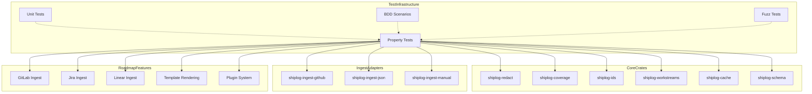

## 1. Core Invariants to Test

### 1.1 Redaction Invariants (Privacy Guarantees)

**Critical Invariants:**

| Invariant | Description | Profile Scope |
|-----------|-------------|---------------|
| `No Sensitive Data Leak` | Original titles, repo names, paths, links, and descriptions must not appear in redacted output | Public, Manager |
| `Deterministic Aliasing` | Same input with same key produces same alias across multiple runs | All profiles |
| `Key Separation` | Different redaction keys produce different aliases | All profiles |
| `Profile Hierarchy` | Internal contains all data, Manager is subset, Public is strict subset | All profiles |
| `Structural Preservation` | Event envelope structure remains valid after redaction | All profiles |
| `Receipt Preservation` | Receipt counts and event relationships maintained | Internal, Manager |
| `Tag Filtering` | Sensitive tags (e.g., "repo") removed in public profile | Public |
| `Source URL Stripping` | Source URLs removed in public profile | Public |
| `Link Removal` | All external links removed in public and manager profiles | Public, Manager |

**Privacy-Specific Invariants:**

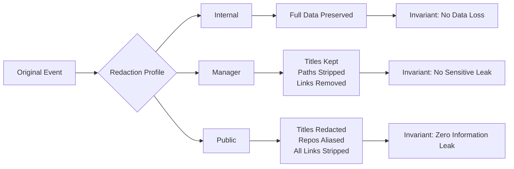

### 1.2 Coverage Calculation Invariants (Time Windowing, Slicing)

**Critical Invariants:**

| Invariant | Description |
|-----------|-------------|
| `Window Non-Overlapping` | Generated windows never overlap |
| `Window Coverage Complete` | Union of all windows equals original range |
| `Window Boundary Alignment` | Windows align to natural boundaries (month start, Monday, day) |
| `Empty Range Returns Empty` | since >= until returns empty vector |
| `Single Day Window` | Day windows always have length 1 |
| `Month Window Length` | Month windows vary by month (28-31 days) |
| `Week Window Length` | Week windows always have length 7 |
| `Window Order Preserved` | Output windows are in chronological order |
| `No Gaps Between Windows` | Consecutive windows are contiguous |
| `Contains Check Correct` | TimeWindow::contains correctly identifies dates |

**Coverage Slice Invariants:**

| Invariant | Description |
|-----------|-------------|
| `Fetched Never Exceeds Total` | fetched <= total_count always holds |
| `Slice Query Correlation` | Slice query matches its time window |
| `Completeness Propagation` | Partial slices set completeness to Partial |
| `Warning Consistency` | Warnings correlate with detected issues |

### 1.3 Event Parsing Invariants (Serialization Round-Trips)

**Critical Invariants:**

| Invariant | Description |
|-----------|-------------|
| `JSON Round-Trip` | EventEnvelope → JSON → EventEnvelope preserves all fields |
| `JSONL Round-Trip` | Vec<EventEnvelope> → JSONL → Vec<EventEnvelope> preserves order and data |
| `YAML Round-Trip` | WorkstreamsFile → YAML → WorkstreamsFile preserves structure |
| `Coverage JSON Round-Trip` | CoverageManifest → JSON → CoverageManifest preserves metadata |
| `Bundle JSON Round-Trip` | BundleManifest → JSON → BundleManifest preserves checksums |
| `SourceSystem Round-Trip` | SourceSystem enum preserves variant information |
| `RepoVisibility Round-Trip` | RepoVisibility enum preserves variant information |
| `PullRequestState Round-Trip` | PullRequestState enum preserves variant information |
| `BundleProfile Round-Trip` | BundleProfile enum preserves variant information |
| `Completeness Round-Trip` | Completeness enum preserves variant information |

**Field-Specific Invariants:**

| Field | Invariant |
|-------|-----------|
| `EventId` | String representation matches inner value |
| `WorkstreamId` | String representation matches inner value |
| `RunId` | String representation matches inner value |
| `DateTime` | RFC3339 serialization round-trips correctly |
| `NaiveDate` | ISO 8601 date serialization round-trips correctly |
| `Optional Fields` | None values round-trip as null/missing |

### 1.4 Clustering Invariants (Workstream Assignment)

**Critical Invariants:**

| Invariant | Description |
|-----------|-------------|
| `All Events Assigned` | Every input event appears in exactly one workstream |
| `No Duplicate Events` | No event ID appears in multiple workstreams |
| `Receipts Subset of Events` | All receipt IDs are present in events list |
| `Stats Consistency` | Workstream stats match actual event counts |
| `Repo Clusterer Invariant` | Events with same repo.full_name end in same workstream |
| `Workstream ID Determinism` | Same events produce same workstream IDs |
| `Receipt Truncation` | Receipt list never exceeds configured maximum |
| `Tag Presence` | Repo-clustered workstreams have "repo" tag |
| `Title Consistency` | Repo-clustered workstream title matches repo name |
| `Version Field` | WorkstreamsFile version is always 1 |

**LLM Clustering Invariants:**

| Invariant | Description |
|-----------|-------------|
| `Fallback Graceful Degradation` | LLM failure falls back to repo clustering |
| `Chunked Clustering Consistency` | Multi-chunk clustering produces valid workstreams |
| `Event Preservation` | No events lost during chunked clustering |
| `Workstream Count Bounded` | Workstream count respects max_workstreams config |

### 1.5 Cache Invariants (Persistence, TTL, Size Limits)

**Critical Invariants:**

| Invariant | Description |
|-----------|-------------|
| `Get-Set Round-Trip` | Value retrieved after set equals original value |
| `TTL Expiration` | Expired entries return None on get |
| `Contains Consistency` | contains() returns true iff get() returns Some |
| `Set Overwrites` | Setting same key replaces previous value |
| `Cleanup Removes Expired` | cleanup_expired() removes all expired entries |
| `Clear Empties Cache` | clear() removes all entries |
| `Persistence Across Opens` | Data survives close and reopen |
| `Default TTL Applied` | set() uses default TTL when not specified |
| `Custom TTL Applied` | set_with_ttl() uses specified TTL |
| `Cache Key Uniqueness` | Different keys store independent values |

**Cache Entry Invariants:**

| Invariant | Description |
|-----------|-------------|
| `Timestamp Monotonic` | cached_at <= expires_at always holds |
| `Expires In Future` | expires_at > cached_at always holds |
| `Data Serialization` | JSON serialization preserves value structure |
| `Key String Validity` | Keys are valid UTF-8 strings |

### 1.6 ID Generation Invariants (Uniqueness, Stability)

**Critical Invariants:**

| Invariant | Description |
|-----------|-------------|
| `EventId Determinism` | Same parts produce same EventId |
| `EventId Uniqueness` | Different parts produce different EventId |
| `WorkstreamId Determinism` | Same parts produce same WorkstreamId |
| `WorkstreamId Uniqueness` | Different parts produce different WorkstreamId |
| `SHA256 Hex Format` | IDs are 64-character lowercase hex strings |
| `Part Boundary Matters` | ["a", "bc"] != ["ab", "c"] |
| `Empty Parts Allowed` | Empty part list produces valid hash |
| `RunId Prefix` | RunId starts with specified prefix |
| `RunId Uniqueness` | Sequential RunId.now() calls produce different values |
| `Display Matches Inner` | format!("{}", id) == id.0 |

**Hash-Specific Invariants:**

| Invariant | Description |
|-----------|-------------|
| `Newline Separator` | Parts joined with newline before hashing |
| `Case Sensitivity` | Different case produces different hash |
| `Whitespace Sensitivity` | Different whitespace produces different hash |

## 2. Property Test Design

### 2.1 Proptest Strategy Architecture

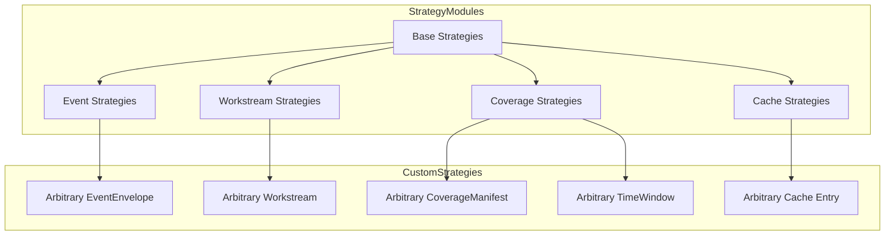

### 2.2 Strategy Modules

#### 2.2.1 Base Strategies Module (`shiplog-testkit::proptest::strategies`)

**Purpose:** Provide reusable primitive strategies for all property tests.

**Strategies:**

```rust
// Date strategies
prop::strategy::strategy_naive_date() -> NaiveDate
prop::strategy::strategy_datetime_utc() -> DateTime<Utc>
prop::strategy::strategy_date_range() -> (NaiveDate, NaiveDate)

// String strategies
prop::strategy::strategy_non_empty_string() -> String
prop::strategy::strategy_repo_name() -> String  // owner/name format
prop::strategy::strategy_url() -> String
prop::strategy::strategy_path_hint() -> String

// Numeric strategies
prop::strategy::strategy_pr_number() -> u64
prop::strategy::strategy_positive_count() -> usize
prop::strategy::strategy_duration_hours() -> i64

// Enum strategies
prop::strategy::strategy_source_system() -> SourceSystem
prop::strategy::strategy_repo_visibility() -> RepoVisibility
prop::strategy::strategy_pr_state() -> PullRequestState
prop::strategy::strategy_event_kind() -> EventKind
prop::strategy::strategy_bundle_profile() -> BundleProfile
prop::strategy::strategy_completeness() -> Completeness
```

**Shrink Behavior:**
- Dates shrink toward epoch (1970-01-01)
- Strings shrink toward empty string
- Numbers shrink toward zero
- Enums shrink toward first variant

#### 2.2.2 Event Strategies Module

**Purpose:** Generate valid [`EventEnvelope`] instances with realistic payloads.

**Strategies:**

```rust
// Complete event envelope
prop::strategy::strategy_event_envelope() -> EventEnvelope

// Payload-specific strategies
prop::strategy::strategy_pr_payload() -> PullRequestEvent
prop::strategy::strategy_review_payload() -> ReviewEvent
prop::strategy::strategy_manual_payload() -> ManualEvent

// Event collections
prop::strategy::strategy_event_vec(max_size: usize) -> Vec<EventEnvelope>
prop::strategy::strategy_event_set(max_size: usize) -> HashSet<EventId>
```

**Generator Design:**

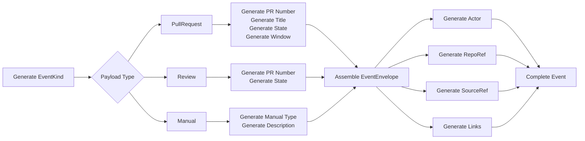

**Shrink Behavior:**
- Events shrink toward minimal valid event (empty strings, zero counts, earliest dates)
- PR numbers shrink toward 1
- Title strings shrink toward empty
- Window shrinks toward single day

#### 2.2.3 Coverage Strategies Module

**Purpose:** Generate valid [`CoverageManifest`] and [`TimeWindow`] instances.

**Strategies:**

```rust
// Time window strategies
prop::strategy::strategy_time_window() -> TimeWindow
prop::strategy::strategy_time_window_aligned(alignment: WindowAlignment) -> TimeWindow
prop::strategy::strategy_time_window_range() -> Vec<TimeWindow>

// Coverage slice strategies
prop::strategy::strategy_coverage_slice() -> CoverageSlice
prop::strategy::strategy_coverage_slice_vec(max_size: usize) -> Vec<CoverageSlice>

// Complete manifest
prop::strategy::strategy_coverage_manifest() -> CoverageManifest
```

**WindowAlignment Enum:**

```rust
enum WindowAlignment {
    Day,      // Align to day boundaries
    Week,     // Align to Monday
    Month,    // Align to 1st of month
    Unaligned, // Arbitrary dates
}
```

**Shrink Behavior:**
- Time windows shrink toward zero-length window
- Slice counts shrink toward 0
- Warnings list shrinks toward empty

#### 2.2.4 Workstream Strategies Module

**Purpose:** Generate valid [`Workstream`] and [`WorkstreamsFile`] instances.

**Strategies:**

```rust
// Individual workstream
prop::strategy::strategy_workstream() -> Workstream
prop::strategy::strategy_workstream_with_stats() -> Workstream

// Workstream collections
prop::strategy::strategy_workstreams_file() -> WorkstreamsFile
prop::strategy::strategy_workstreams_file_with_events(events: &[EventId]) -> WorkstreamsFile

// Stats strategies
prop::strategy::strategy_workstream_stats() -> WorkstreamStats
```

**Generator Constraints:**
- All receipt IDs must be in events list
- Stats must match actual event counts
- Workstream IDs must be deterministic from title

**Shrink Behavior:**
- Workstreams shrink toward empty workstream
- Receipts list shrinks toward empty
- Tags list shrinks toward empty
- Stats shrink toward zero

#### 2.2.5 Cache Strategies Module

**Purpose:** Generate cache keys, values, and TTL configurations.

**Strategies:**

```rust
// Cache key strategies
prop::strategy::strategy_cache_key() -> String
prop::strategy::strategy_api_url() -> String

// TTL strategies
prop::strategy::strategy_ttl_duration() -> Duration
prop::strategy::strategy_ttl_hours(hours: i64) -> Duration

// Cache entry strategies
prop::strategy::strategy_cache_entry() -> (String, serde_json::Value, Duration)
prop::strategy::strategy_cache_entry_vec(max_size: usize) -> Vec<(String, serde_json::Value, Duration)>
```

**Shrink Behavior:**
- TTL shrinks toward zero
- Keys shrink toward empty string
- Values shrink toward null/empty

### 2.3 Property Test Specifications

#### 2.3.1 Redaction Property Tests

**Test 1: Aliases Are Stable For Same Key**

```rust
proptest! {
    #[test]
    fn prop_aliases_are_stable_for_same_key(
        kind in "repo|ws|actor",
        value in "[a-zA-Z0-9_-]{1,100}",
        key_bytes in prop::collection::vec(any::<u8>(), 1..32)
    ) {
        let r = DeterministicRedactor::new(&key_bytes);
        let a1 = r.alias(&kind, &value);
        let a2 = r.alias(&kind, &value);
        prop_assert_eq!(a1, a2);
    }
}
```

**Test 2: Different Keys Produce Different Aliases**

```rust
proptest! {
    #[test]
    fn prop_different_keys_produce_different_aliases(
        kind in "repo|ws",
        value in "[a-zA-Z0-9_-]{1,50}",
        key1 in prop::collection::vec(any::<u8>(), 1..32),
        key2 in prop::collection::vec(any::<u8>(), 1..32)
    ) {
        prop_assume!(key1 != key2);
        let r1 = DeterministicRedactor::new(&key1);
        let r2 = DeterministicRedactor::new(&key2);
        let a1 = r1.alias(&kind, &value);
        let a2 = r2.alias(&kind, &value);
        prop_assert_ne!(a1, a2);
    }
}
```

**Test 3: Public Profile Redacts All Sensitive Data**

```rust
proptest! {
    #[test]
    fn prop_public_profile_redacts_all_sensitive_data(
        events in prop::collection::vec(strategy_event_envelope(), 0..20),
        key_bytes in prop::collection::vec(any::<u8>(), 1..32)
    ) {
        let r = DeterministicRedactor::new(&key_bytes);
        let redacted = r.redact_events(&events, "public").unwrap();

        for (orig, red) in events.iter().zip(redacted.iter()) {
            // Check titles are redacted
            match &red.payload {
                EventPayload::PullRequest(pr) => {
                    prop_assert_eq!(&pr.title, "[redacted]");
                    prop_assert!(pr.touched_paths_hint.is_empty());
                }
                EventPayload::Review(r) => {
                    prop_assert_eq!(&r.pull_title, "[redacted]");
                }
                EventPayload::Manual(m) => {
                    prop_assert_eq!(&m.title, "[redacted]");
                    prop_assert!(m.description.is_none());
                    prop_assert!(m.impact.is_none());
                }
            }

            // Check links are removed
            prop_assert!(red.links.is_empty());

            // Check source URL is removed
            prop_assert!(red.source.url.is_none());

            // Check repo is aliased (not equal to original)
            prop_assert_ne!(red.repo.full_name, orig.repo.full_name);
        }
    }
}
```

**Test 4: Manager Profile Preserves Titles But Removes Paths**

```rust
proptest! {
    #[test]
    fn prop_manager_profile_preserves_titles_removes_paths(
        events in prop::collection::vec(strategy_event_envelope(), 0..20),
        key_bytes in prop::collection::vec(any::<u8>(), 1..32)
    ) {
        let r = DeterministicRedactor::new(&key_bytes);
        let redacted = r.redact_events(&events, "manager").unwrap();

        for (orig, red) in events.iter().zip(redacted.iter()) {
            match (&orig.payload, &red.payload) {
                (EventPayload::PullRequest(orig_pr), EventPayload::PullRequest(red_pr)) => {
                    // Title preserved
                    prop_assert_eq!(orig_pr.title, red_pr.title);
                    // Paths removed
                    prop_assert!(red_pr.touched_paths_hint.is_empty());
                }
                (EventPayload::Manual(orig_m), EventPayload::Manual(red_m)) => {
                    // Title preserved
                    prop_assert_eq!(orig_m.title, red_m.title);
                    // Description removed
                    prop_assert!(red_m.description.is_none());
                    prop_assert!(red_m.impact.is_none());
                }
                _ => {}
            }

            // Links removed
            prop_assert!(red.links.is_empty());
        }
    }
}
```

**Test 5: Sensitive Strings Never Leak In JSON Output**

```rust
proptest! {
    #[test]
    fn prop_sensitive_strings_redacted(
        title in "[a-zA-Z0-9_-]{10,100}",
        repo in r"[a-z0-9_-]+/[a-z0-9_-]+",
        path_hint in "[a-zA-Z0-9_/-]{5,50}",
        link_url in "https://[a-z0-9.-]+/[a-z0-9._/-]+",
        key_bytes in prop::collection::vec(any::<u8>(), 1..32)
    ) {
        let r = DeterministicRedactor::new(&key_bytes);

        let ev = EventEnvelope {
            id: EventId::from_parts(["test", "1"]),
            kind: EventKind::PullRequest,
            occurred_at: Utc::now(),
            actor: Actor { login: "user".into(), id: None },
            repo: RepoRef {
                full_name: repo.clone(),
                html_url: Some(link_url.clone()),
                visibility: RepoVisibility::Private,
            },
            payload: EventPayload::PullRequest(PullRequestEvent {
                number: 1,
                title: title.clone(),
                state: PullRequestState::Merged,
                created_at: Utc::now(),
                merged_at: Some(Utc::now()),
                additions: Some(10),
                deletions: Some(5),
                changed_files: Some(3),
                touched_paths_hint: vec![path_hint.clone()],
                window: None,
            }),
            tags: vec![],
            links: vec![Link { label: "pr".into(), url: link_url.clone() }],
            source: SourceRef {
                system: SourceSystem::Github,
                url: Some(link_url.clone()),
                opaque_id: None,
            },
        };

        let out = r.redact_events(&[ev], "public").unwrap();
        let json = serde_json::to_string(&out)?;

        prop_assert!(!json.contains(&title));
        prop_assert!(!json.contains(&repo));
        prop_assert!(!json.contains(&path_hint));
        prop_assert!(!json.contains(&link_url));
    }
}
```

#### 2.3.2 Coverage Property Tests

**Test 1: Windows Are Non-Overlapping**

```rust
proptest! {
    #[test]
    fn prop_month_windows_non_overlapping(
        since in strategy_naive_date(),
        days_offset in 1..730u64  // Up to 2 years
    ) {
        let until = since + chrono::Duration::days(days_offset as i64);
        let windows = month_windows(since, until);

        for i in 0..windows.len() {
            for j in (i + 1)..windows.len() {
                prop_assert!(!windows[i].overlaps(&windows[j]));
            }
        }
    }
}
```

**Test 2: Windows Cover Complete Range**

```rust
proptest! {
    #[test]
    fn prop_windows_cover_complete_range(
        since in strategy_naive_date(),
        days_offset in 1..730u64
    ) {
        let until = since + chrono::Duration::days(days_offset as i64);

        // Test all window types
        for (name, windows_fn) in [
            ("day", day_windows as fn(_, _) -> _),
            ("week", week_windows as fn(_, _) -> _),
            ("month", month_windows as fn(_, _) -> _),
        ] {
            let windows = windows_fn(since, until);

            if windows.is_empty() {
                continue;
            }

            // First window starts at since
            prop_assert_eq!(windows[0].since, since);

            // Last window ends at until
            prop_assert_eq!(windows.last().unwrap().until, until);

            // No gaps between windows
            for i in 0..windows.len() - 1 {
                prop_assert_eq!(windows[i].until, windows[i + 1].since);
            }
        }
    }
}
```

**Test 3: Window Length Invariants**

```rust
proptest! {
    #[test]
    fn prop_window_length_invariants(
        since in strategy_naive_date(),
        days_offset in 1..365u64
    ) {
        let until = since + chrono::Duration::days(days_offset as i64);

        // Day windows always length 1
        let day_ws = day_windows(since, until);
        for w in &day_ws {
            prop_assert_eq!(window_len_days(w), 1);
        }

        // Week windows always length 7
        let week_ws = week_windows(since, until);
        for w in &week_ws {
            prop_assert_eq!(window_len_days(w), 7);
        }

        // Month windows vary by month
        let month_ws = month_windows(since, until);
        for w in &month_ws {
            let len = window_len_days(w);
            prop_assert!(len >= 28 && len <= 31);
        }
    }
}
```

**Test 4: Empty Range Returns Empty**

```rust
proptest! {
    #[test]
    fn prop_empty_range_returns_empty(
        date in strategy_naive_date()
    ) {
        prop_assert!(month_windows(date, date).is_empty());
        prop_assert!(week_windows(date, date).is_empty());
        prop_assert!(day_windows(date, date).is_empty());
        prop_assert!(month_windows(date, date - chrono::Duration::days(1)).is_empty());
    }
}
```

**Test 5: Coverage Slice Consistency**

```rust
proptest! {
    #[test]
    fn prop_coverage_slice_consistency(
        window in strategy_time_window(),
        total_count in 0..10000u64,
        fetched in 0..10000u64,
        incomplete in prop::bool::ANY
    ) {
        let mut slice = CoverageSlice {
            window: window.clone(),
            query: format!("query for {:?}", window),
            total_count,
            fetched,
            incomplete_results: Some(incomplete),
            notes: vec![],
        };

        // Fetched never exceeds total
        prop_assert!(slice.fetched <= slice.total_count);

        // If incomplete, fetched < total
        if incomplete {
            prop_assert!(slice.fetched < slice.total_count);
        }
    }
}
```

#### 2.3.3 Event Parsing Property Tests

**Test 1: EventEnvelope JSON Round-Trip**

```rust
proptest! {
    #[test]
    fn prop_event_envelope_json_round_trip(
        event in strategy_event_envelope()
    ) {
        let json = serde_json::to_string(&event)?;
        let parsed: EventEnvelope = serde_json::from_str(&json)?;
        prop_assert_eq!(event, parsed);
    }
}
```

**Test 2: EventEnvelope JSONL Round-Trip**

```rust
proptest! {
    #[test]
    fn prop_event_envelope_jsonl_round_trip(
        events in prop::collection::vec(strategy_event_envelope(), 0..50)
    ) {
        let jsonl: String = events
            .iter()
            .map(|e| serde_json::to_string(e).unwrap())
            .collect::<Vec<_>>()
            .join("\n");

        let parsed: Vec<EventEnvelope> = jsonl
            .lines()
            .filter(|l| !l.trim().is_empty())
            .map(|l| serde_json::from_str(l).unwrap())
            .collect();

        prop_assert_eq!(events, parsed);
    }
}
```

**Test 3: WorkstreamsFile YAML Round-Trip**

```rust
proptest! {
    #[test]
    fn prop_workstreams_file_yaml_round_trip(
        ws_file in strategy_workstreams_file()
    ) {
        let yaml = serde_yaml::to_string(&ws_file)?;
        let parsed: WorkstreamsFile = serde_yaml::from_str(&yaml)?;
        prop_assert_eq!(ws_file, parsed);
    }
}
```

**Test 4: SourceSystem Enum Round-Trip**

```rust
proptest! {
    #[test]
    fn prop_source_system_enum_round_trip(
        system in strategy_source_system()
    ) {
        let json = serde_json::to_string(&system)?;
        let parsed: SourceSystem = serde_json::from_str(&json)?;
        prop_assert_eq!(system, parsed);
    }
}
```

**Test 5: DateTime RFC3339 Round-Trip**

```rust
proptest! {
    #[test]
    fn prop_datetime_rfc3339_round_trip(
        dt in strategy_datetime_utc()
    ) {
        let rfc3339 = dt.to_rfc3339();
        let parsed = chrono::DateTime::parse_from_rfc3339(&rfc3339)?;
        prop_assert_eq!(dt, parsed);
    }
}
```

#### 2.3.4 Clustering Property Tests

**Test 1: All Events Assigned Exactly Once**

```rust
proptest! {
    #[test]
    fn prop_all_events_assigned_exactly_once(
        events in prop::collection::vec(strategy_event_envelope(), 0..50)
    ) {
        let clusterer = RepoClusterer;
        let ws_file = clusterer.cluster(&events).unwrap();

        let mut assigned_event_ids: HashSet<EventId> = HashSet::new();

        for ws in &ws_file.workstreams {
            for event_id in &ws.events {
                prop_assert!(!assigned_event_ids.contains(event_id),
                    "Event {:?} assigned to multiple workstreams", event_id);
                assigned_event_ids.insert(event_id.clone());
            }
        }

        // All input events are assigned
        for ev in &events {
            prop_assert!(assigned_event_ids.contains(&ev.id),
                "Event {:?} not assigned to any workstream", ev.id);
        }

        // Count matches
        prop_assert_eq!(assigned_event_ids.len(), events.len());
    }
}
```

**Test 2: Receipts Are Subset Of Events**

```rust
proptest! {
    #[test]
    fn prop_receipts_are_subset_of_events(
        events in prop::collection::vec(strategy_event_envelope(), 0..50)
    ) {
        let clusterer = RepoClusterer;
        let ws_file = clusterer.cluster(&events).unwrap();

        for ws in &ws_file.workstreams {
            let event_set: HashSet<_> = ws.events.iter().collect();
            for receipt_id in &ws.receipts {
                prop_assert!(event_set.contains(receipt_id),
                    "Receipt {:?} not in events list for workstream {:?}",
                    receipt_id, ws.id);
            }
        }
    }
}
```

**Test 3: Stats Match Actual Event Counts**

```rust
proptest! {
    #[test]
    fn prop_stats_match_actual_event_counts(
        events in prop::collection::vec(strategy_event_envelope(), 0..50)
    ) {
        let clusterer = RepoClusterer;
        let ws_file = clusterer.cluster(&events).unwrap();

        for ws in &ws_file.workstreams {
            let event_map: HashMap<EventId, &EventEnvelope> = events
                .iter()
                .filter(|e| ws.events.contains(&e.id))
                .map(|e| (e.id.clone(), e))
                .collect();

            let mut actual_stats = WorkstreamStats::zero();
            for ev in event_map.values() {
                actual_stats.bump_stats(&ev.kind);
            }

            prop_assert_eq!(ws.stats, actual_stats);
        }
    }
}
```

**Test 4: Repo Clusterer Groups By Repo**

```rust
proptest! {
    #[test]
    fn prop_repo_clusterer_groups_by_repo(
        events in prop::collection::vec(strategy_event_envelope(), 0..50)
    ) {
        let clusterer = RepoClusterer;
        let ws_file = clusterer.cluster(&events).unwrap();

        // Build repo -> workstream mapping
        let mut repo_to_ws: HashMap<String, &Workstream> = HashMap::new();
        for ws in &ws_file.workstreams {
            repo_to_ws.insert(ws.title.clone(), ws);
        }

        // Verify all events in a workstream have the same repo
        for ws in &ws_file.workstreams {
            for event_id in &ws.events {
                let ev = events.iter().find(|e| &e.id == event_id).unwrap();
                prop_assert_eq!(&ev.repo.full_name, &ws.title);
            }
        }
    }
}
```

**Test 5: Receipt Truncation Respects Maximum**

```rust
proptest! {
    #[test]
    fn prop_receipt_truncation_respects_maximum(
        events in prop::collection::vec(strategy_event_envelope(), 0..100)
    ) {
        let clusterer = RepoClusterer;
        let ws_file = clusterer.cluster(&events).unwrap();

        const MAX_RECEIPTS: usize = 10;

        for ws in &ws_file.workstreams {
            prop_assert!(ws.receipts.len() <= MAX_RECEIPTS,
                "Workstream {:?} has {} receipts, exceeds maximum of {}",
                ws.id, ws.receipts.len(), MAX_RECEIPTS);
        }
    }
}
```

#### 2.3.5 Cache Property Tests

**Test 1: Get-Set Round-Trip**

```rust
proptest! {
    #[test]
    fn prop_cache_get_set_round_trip(
        key in "[a-zA-Z0-9_-]{1,100}",
        value in prop::collection::vec(any::<u8>(), 0..1024)
    ) {
        let cache = ApiCache::open_in_memory()?;
        let test_value: serde_json::Value = serde_json::from_slice(&value)?;

        cache.set(&key, &test_value)?;
        let retrieved = cache.get::<serde_json::Value>(&key)?;

        prop_assert_eq!(Some(test_value), retrieved);
    }
}
```

**Test 2: TTL Expiration**

```rust
proptest! {
    #[test]
    fn prop_cache_ttl_expiration(
        key in "[a-zA-Z0-9_-]{1,50}",
        value in prop::collection::vec(any::<u8>(), 0..512),
        ttl_ms in 10..1000u64
    ) {
        let cache = ApiCache::open_in_memory()?;
        let test_value: serde_json::Value = serde_json::from_slice(&value)?;

        let ttl = Duration::milliseconds(ttl_ms as i64);
        cache.set_with_ttl(&key, &test_value, ttl)?;

        // Before expiration
        prop_assert!(cache.contains(&key)?);

        // After expiration
        std::thread::sleep(Duration::milliseconds(ttl_ms as i64 + 100));
        prop_assert!(!cache.contains(&key)?);
        prop_assert!(cache.get::<serde_json::Value>(&key)?.is_none());
    }
}
```

**Test 3: Contains Consistency**

```rust
proptest! {
    #[test]
    fn prop_cache_contains_consistency(
        keys in prop::collection::vec("[a-zA-Z0-9_-]{1,50}", 0..20),
        values in prop::collection::vec(prop::collection::vec(any::<u8>(), 0..512), 0..20)
    ) {
        let cache = ApiCache::open_in_memory()?;

        for (key, value_bytes) in keys.iter().zip(values.iter()) {
            let test_value: serde_json::Value = serde_json::from_slice(value_bytes).unwrap();
            cache.set(key, &test_value)?;
        }

        for key in &keys {
            let contains = cache.contains(key)?;
            let get_result = cache.get::<serde_json::Value>(key)?;
            prop_assert_eq!(contains, get_result.is_some());
        }
    }
}
```

**Test 4: Cleanup Removes Expired**

```rust
proptest! {
    #[test]
    fn prop_cache_cleanup_removes_expired(
        keys in prop::collection::vec("[a-zA-Z0-9_-]{1,50}", 1..20),
        ttls in prop::collection::vec(10..500u64, 1..20)
    ) {
        let cache = ApiCache::open_in_memory()?;

        for (key, ttl_ms) in keys.iter().zip(ttls.iter()) {
            let test_value = serde_json::json!({ "key": key });
            let ttl = Duration::milliseconds(*ttl_ms as i64);
            cache.set_with_ttl(key, &test_value, ttl)?;
        }

        // Wait for all to expire
        std::thread::sleep(Duration::milliseconds(600));

        let deleted = cache.cleanup_expired()?;
        prop_assert_eq!(deleted, keys.len());

        for key in &keys {
            prop_assert!(!cache.contains(key)?);
        }
    }
}
```

**Test 5: Set Overwrites Previous Value**

```rust
proptest! {
    #[test]
    fn prop_cache_set_overwrites(
        key in "[a-zA-Z0-9_-]{1,50}",
        value1 in prop::collection::vec(any::<u8>(), 0..512),
        value2 in prop::collection::vec(any::<u8>(), 0..512)
    ) {
        let cache = ApiCache::open_in_memory()?;
        let test_value1: serde_json::Value = serde_json::from_slice(&value1)?;
        let test_value2: serde_json::Value = serde_json::from_slice(&value2)?;

        cache.set(&key, &test_value1)?;
        cache.set(&key, &test_value2)?;

        let retrieved = cache.get::<serde_json::Value>(&key)?;
        prop_assert_eq!(Some(test_value2), retrieved);
    }
}
```

#### 2.3.6 ID Generation Property Tests

**Test 1: EventId Determinism**

```rust
proptest! {
    #[test]
    fn prop_event_id_deterministic(
        parts in prop::collection::vec("[a-zA-Z0-9_-]{1,50}", 1..10)
    ) {
        let id1 = EventId::from_parts(parts.iter());
        let id2 = EventId::from_parts(parts.iter());
        prop_assert_eq!(id1, id2);
    }
}
```

**Test 2: EventId Uniqueness**

```rust
proptest! {
    #[test]
    fn prop_event_id_uniqueness(
        parts1 in prop::collection::vec("[a-zA-Z0-9_-]{1,50}", 1..10),
        parts2 in prop::collection::vec("[a-zA-Z0-9_-]{1,50}", 1..10)
    ) {
        prop_assume!(parts1 != parts2);
        let id1 = EventId::from_parts(parts1.iter());
        let id2 = EventId::from_parts(parts2.iter());
        prop_assert_ne!(id1, id2);
    }
}
```

**Test 3: SHA256 Hex Format**

```rust
proptest! {
    #[test]
    fn prop_id_sha256_hex_format(
        parts in prop::collection::vec("[a-zA-Z0-9_-]{1,50}", 0..10)
    ) {
        let event_id = EventId::from_parts(parts.iter());
        let workstream_id = WorkstreamId::from_parts(parts.iter());

        prop_assert_eq!(event_id.0.len(), 64);
        prop_assert!(event_id.0.chars().all(|c| c.is_ascii_hexdigit() && c.is_lowercase()));

        prop_assert_eq!(workstream_id.0.len(), 64);
        prop_assert!(workstream_id.0.chars().all(|c| c.is_ascii_hexdigit() && c.is_lowercase()));
    }
}
```

**Test 4: Part Boundary Matters**

```rust
proptest! {
    #[test]
    fn prop_part_boundary_matters(
        a in "[a-zA-Z0-9_-]{1,20}",
        b in "[a-zA-Z0-9_-]{1,20}",
        c in "[a-zA-Z0-9_-]{1,20}"
    ) {
        prop_assume!(b != c);
        let id1 = EventId::from_parts([a.as_str(), b.as_str()]);
        let id2 = EventId::from_parts([format!("{}{}", a, b).as_str(), c.as_str()]);
        prop_assert_ne!(id1, id2);
    }
}
```

**Test 5: RunId Prefix And Uniqueness**

```rust
proptest! {
    #[test]
    fn prop_run_id_prefix_and_uniqueness(
        prefix in "[a-z]{3,10}",
        count in 2..10usize
    ) {
        let mut ids = Vec::new();

        for _ in 0..count {
            let id = RunId::now(&prefix);
            prop_assert!(id.0.starts_with(&format!("{}_", prefix)));
            prop_assert!(!ids.contains(&id));
            ids.push(id);
        }
    }
}
```

## 3. Implementation Strategy

### 3.1 Crates Requiring Property Tests

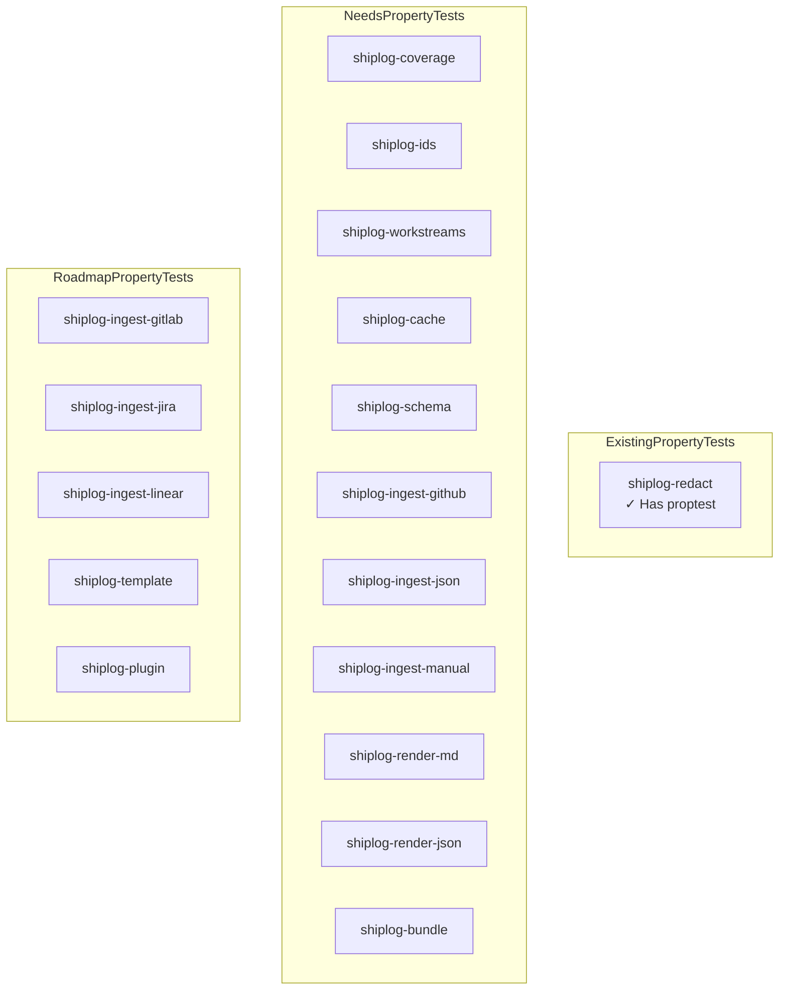

### 3.2 Test Structure

#### 3.2.1 Property Test Module Organization

```
crates/
├── shiplog-testkit/
│   └── src/
│       ├── lib.rs
│       ├── bdd.rs
│       └── proptest/
│           ├── mod.rs
│           ├── strategies.rs        # Base strategies
│           ├── event_strategies.rs   # Event-specific strategies
│           ├── coverage_strategies.rs
│           ├── workstream_strategies.rs
│           └── cache_strategies.rs
│
├── shiplog-redact/
│   └── src/
│       └── lib.rs
│           └── #[cfg(test)]
│               └── mod proptest_tests
│
├── shiplog-coverage/
│   └── src/
│       └── lib.rs
│           └── #[cfg(test)]
│               └── mod proptest_tests
│
├── shiplog-ids/
│   └── src/
│       └── lib.rs
│           └── #[cfg(test)]
│               └── mod proptest_tests
│
├── shiplog-workstreams/
│   └── src/
│       └── lib.rs
│           └── #[cfg(test)]
│               └── mod proptest_tests
│
├── shiplog-cache/
│   └── src/
│       └── lib.rs
│           └── #[cfg(test)]
│               └── mod proptest_tests
│
└── shiplog-schema/
    └── src/
        ├── lib.rs
        └── #[cfg(test)]
            └── mod proptest_tests
```

#### 3.2.2 Test File Naming Convention

Each crate's property tests should be organized as follows:

```rust
// In each crate's lib.rs
#[cfg(test)]
mod proptest_tests {
    use super::*;
    use proptest::prelude::*;
    use shiplog_testkit::proptest::strategies::*;

    // Property tests here
}
```

For larger test suites, consider separate test modules:

```rust
#[cfg(test)]
mod proptest_tests {
    mod redaction;
    mod serialization;
    mod clustering;
    // etc.
}
```

### 3.3 Integration with Existing Test Suites

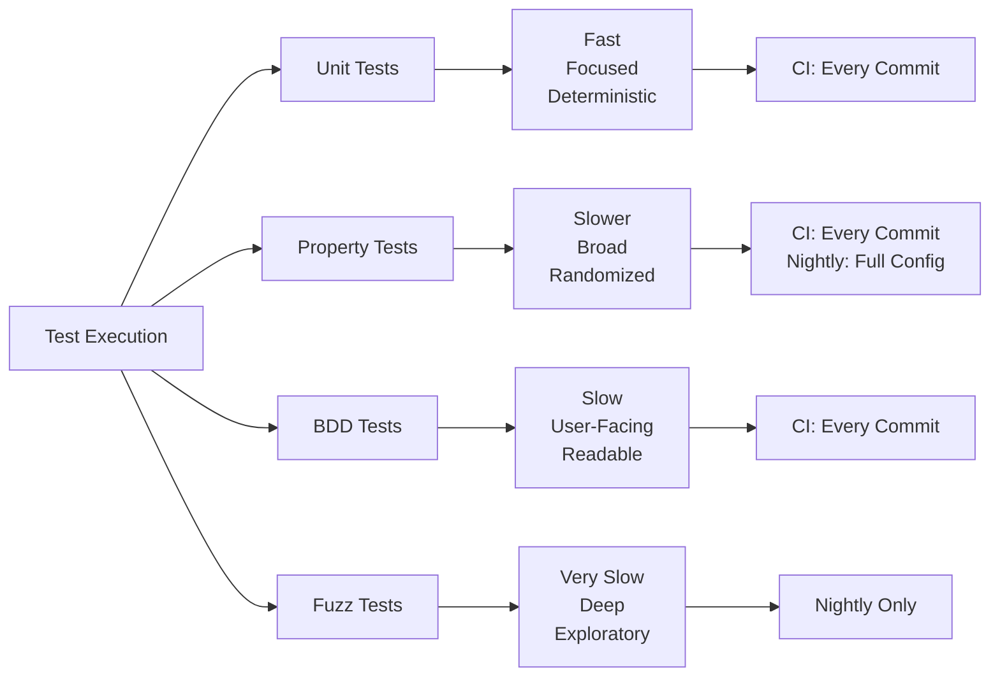

**Test Execution Strategy:**

| Test Type | CI Frequency | Parallelization | Timeout |
|-----------|--------------|-----------------|---------|
| Unit Tests | Every commit | High | 5 min |
| Property Tests | Every commit | Medium | 10 min |
| BDD Tests | Every commit | Low | 5 min |
| Fuzz Tests | Nightly | Low | 60 min |

### 3.4 Performance Considerations

#### 3.4.1 Proptest Configuration

```toml
# In each crate's Cargo.toml

[dev-dependencies]
proptest.workspace = true

# In .cargo/config.toml or environment
[profile.dev.package.proptest]
opt-level = 3

# Proptest settings
[env]
PROPTEST_CASES = "256"           # Default cases per test
PROPTEST_MAX_LOCAL_REJECTS = "10000"
PROPTEST_MAX_GLOBAL_REJECTS = "1000000"
PROPTEST_MAX_FLAT_MAP_REGENS = "1000"
```

#### 3.4.2 Test Case Optimization

```rust
// Use prop_assume! to filter invalid cases efficiently
proptest! {
    #[test]
    fn prop_example(
        value in 0..1000u32
    ) {
        // Filter early to avoid expensive operations
        prop_assume!(value % 2 == 0);

        // Expensive operation here
        let result = expensive_computation(value);
        prop_assert!(result.is_valid());
    }
}

// Use prop_map! for efficient transformations
proptest! {
    #[test]
    fn prop_efficient_generation(
        pair in (0..100u32, 0..100u32).prop_map(|(a, b)| (a * b, a + b))
    ) {
        // Use transformed values directly
    }
}
```

#### 3.4.3 Shrink Strategy

```rust
// Custom shrink for complex types
fn shrink_event_envelope(event: EventEnvelope) -> Box<dyn Iterator<Item = EventEnvelope>> {
    let mut shrinks = Vec::new();

    // Shrink toward minimal event
    shrinks.push(EventEnvelope {
        id: EventId::from_parts(["min"]),
        kind: EventKind::Manual,
        occurred_at: Utc.timestamp(0, 0),
        actor: Actor { login: String::new(), id: None },
        repo: RepoRef {
            full_name: String::new(),
            html_url: None,
            visibility: RepoVisibility::Unknown,
        },
        payload: EventPayload::Manual(ManualEvent {
            event_type: ManualEventType::Note,
            title: String::new(),
            description: None,
            impact: None,
            occurred_at: Utc.timestamp(0, 0),
        }),
        tags: Vec::new(),
        links: Vec::new(),
        source: SourceRef {
            system: SourceSystem::Manual,
            url: None,
            opaque_id: None,
        },
    });

    // Shrink individual fields
    shrinks.extend(shrink_string(&event.id.0).map(|id| {
        let mut e = event.clone();
        e.id = EventId(id);
        e
    }));

    Box::new(shrinks.into_iter())
}
```

### 3.5 Test Utilities Module

Create a new module in `shiplog-testkit` for property test utilities:

```rust
// crates/shiplog-testkit/src/proptest/mod.rs

pub mod strategies;
pub mod assertions;
pub mod fixtures;

pub use strategies::*;
pub use assertions::*;
pub use fixtures::*;

// Common test configurations
pub const DEFAULT_TEST_CASES: u32 = 256;
pub const QUICK_TEST_CASES: u32 = 32;
pub const THOROUGH_TEST_CASES: u32 = 1024;
```

## 4. Coverage Analysis

### 4.1 Edge Cases Property Tests Should Catch

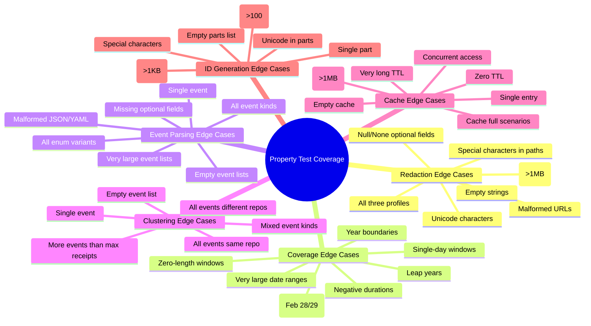

### 4.2 Complementarity with Other Test Types

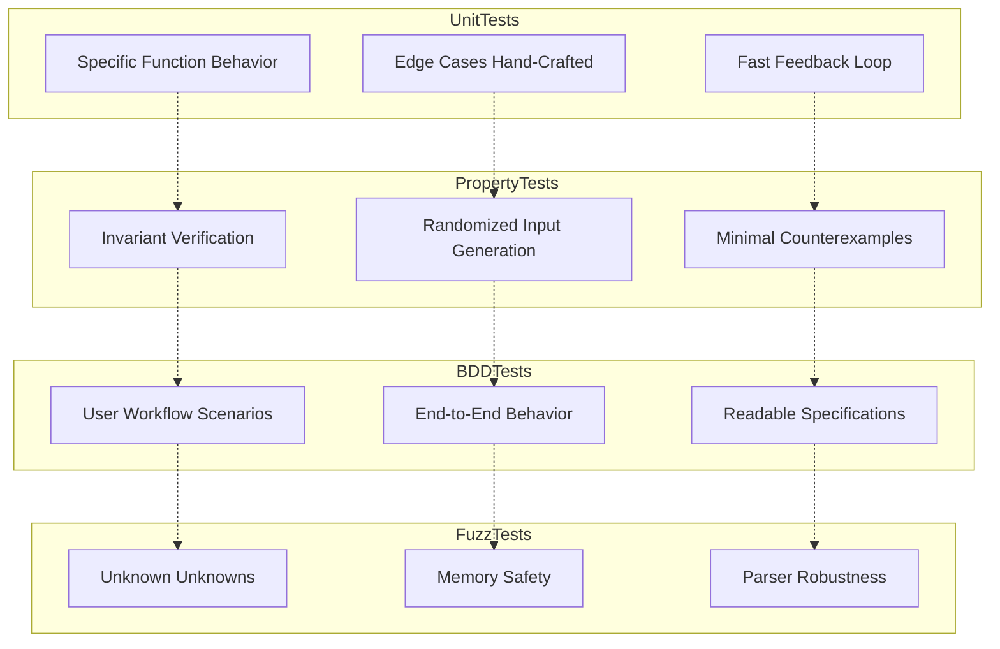

**Test Type Comparison:**

| Aspect | Unit Tests | Property Tests | BDD Tests | Fuzz Tests |
|--------|-----------|----------------|-----------|------------|
| **Input Generation** | Hand-crafted | Randomized | Hand-crafted | Randomized |
| **Scope** | Single function | Invariant-focused | End-to-end | Input parsing |
| **Speed** | Fast | Medium | Slow | Very Slow |
| **Feedback** | Specific | Minimal counterexample | Human-readable | Crash dump |
| **Maintenance** | High | Low | Medium | Low |
| **Best For** | Logic bugs | Invariant violations | Workflow bugs | Security bugs |

### 4.3 Metrics for Property Test Effectiveness

#### 4.3.1 Quantitative Metrics

```rust
// Metrics to track in CI
pub struct PropertyTestMetrics {
    // Coverage metrics
    pub total_properties: usize,
    pub passing_properties: usize,
    pub failing_properties: usize,

    // Execution metrics
    pub total_cases_run: u64,
    pub avg_cases_per_property: f64,
    pub max_cases_per_property: u64,
    pub avg_execution_time_ms: f64,

    // Shrink metrics
    pub avg_shrink_steps: f64,
    pub max_shrink_steps: u64,
    pub avg_original_case_size: usize,
    pub avg_shrunk_case_size: usize,

    // Discovery metrics
    pub bugs_found_this_run: usize,
    pub bugs_found_total: usize,
    pub unique_counterexamples: usize,
}
```

#### 4.3.2 Qualitative Metrics

| Metric | Description | Target |
|--------|-------------|--------|
| **Invariant Coverage** | Percentage of documented invariants with tests | 100% |
| **Code Coverage** | Lines covered by property tests | >80% |
| **Bug Discovery Rate** | Bugs found per 100 test runs | >0.5 |
| **False Positive Rate** | Tests that fail due to test bugs | <1% |
| **Shrink Effectiveness** | Average size reduction ratio | >50% |
| **Test Stability** | Flaky test rate | <0.1% |

#### 4.3.3 CI Integration

```yaml
# Example GitHub Actions workflow
name: Property Tests

on: [push, pull_request]

jobs:
  property-tests:
    runs-on: ubuntu-latest
    steps:
      - uses: actions/checkout@v4

      - name: Install Rust
        uses: dtolnay/rust-toolchain@stable

      - name: Run property tests
        run: |
          cargo test --all --lib --test-threads=1 \
            -- --test-threads=1 \
            --nocapture \
            --format json | tee test-results.json

      - name: Upload test results
        uses: actions/upload-artifact@v4
        with:
          name: property-test-results
          path: test-results.json

      - name: Generate coverage report
        run: |
          cargo tarpaulin --out Xml --all --lib

      - name: Upload coverage
        uses: codecov/codecov-action@v4
```

## 5. ROADMAP Feature Integration

### 5.1 GitLab Ingest Adapter Property Tests

**New Invariants:**

| Invariant | Description |
|-----------|-------------|
| `MergeRequest Round-Tip` | GitLab merge request data round-trips correctly |
| `GitLab Event Mapping` | GitLab events map to correct EventKind |
| `Self-Hosted Compatibility` | Self-hosted GitLab instances work correctly |
| `Pagination Consistency` | Paginated API responses merge correctly |

**Strategies to Add:**

```rust
// GitLab-specific strategies
prop::strategy::strategy_gitlab_mr_event() -> GitLabMergeRequestEvent
prop::strategy::strategy_gitlab_review_event() -> GitLabReviewEvent
prop::strategy::strategy_gitlab_project() -> GitLabProject
prop::strategy::strategy_gitlab_user() -> GitLabUser
```

**Property Tests:**

```rust
proptest! {
    #[test]
    fn prop_gitlab_mr_to_event_envelope(
        mr in strategy_gitlab_mr_event()
    ) {
        let envelope = gitlab_mr_to_envelope(&mr)?;
        prop_assert_eq!(envelope.kind, EventKind::PullRequest);
        prop_assert!(!envelope.id.0.is_empty());
    }

    #[test]
    fn prop_gitlab_pagination_consistency(
        pages in prop::collection::vec(strategy_gitlab_mr_page(), 1..10)
    ) {
        let merged = merge_gitlab_pages(&pages)?;
        let total_count: usize = pages.iter().map(|p| p.len()).sum();
        prop_assert_eq!(merged.len(), total_count);
    }
}
```

### 5.2 Jira/Linear Ingest Adapter Property Tests

**New Invariants:**

| Invariant | Description |
|-----------|-------------|
| `Issue Round-Trip` | Jira/Linear issue data round-trips correctly |
| `Issue Event Mapping` | Issues map to ManualEvent with correct type |
| `Field Mapping` | Custom fields map correctly to event fields |
| `Multi-Source Consistency` | Events from different sources merge correctly |

**Strategies to Add:**

```rust
// Jira/Linear strategies
prop::strategy::strategy_jira_issue() -> JiraIssue
prop::strategy::strategy_linear_issue() -> LinearIssue
prop::strategy::strategy_issue_event() -> ManualEvent
prop::strategy::strategy_custom_field() -> CustomField
```

**Property Tests:**

```rust
proptest! {
    #[test]
    fn prop_jira_issue_to_manual_event(
        issue in strategy_jira_issue()
    ) {
        let event = jira_issue_to_event(&issue)?;
        prop_assert!(matches!(event.payload, EventPayload::Manual(_)));
        prop_assert_eq!(event.source.system, SourceSystem::Other("jira".into()));
    }

    #[test]
    fn prop_multi_source_event_uniqueness(
        github_events in prop::collection::vec(strategy_event_envelope(), 0..20),
        jira_events in prop::collection::vec(strategy_jira_issue(), 0..20),
    ) {
        let all_events = merge_multi_source(&github_events, &jira_events)?;
        let ids: HashSet<_> = all_events.iter().map(|e| &e.id).collect();
        prop_assert_eq!(ids.len(), all_events.len());
    }
}
```

### 5.3 Multi-Source Merging Property Tests

**New Invariants:**

| Invariant | Description |
|-----------|-------------|
| `No Duplicate Events` | Merged events have unique IDs |
| `Chronological Order` | Events are sorted by occurred_at |
| `Source Preservation` | Source information is preserved |
| `Coverage Aggregation` | Coverage manifests merge correctly |

**Property Tests:**

```rust
proptest! {
    #[test]
    fn prop_multi_source_no_duplicates(
        sources in prop::collection::vec(
            (strategy_source_system(), prop::collection::vec(strategy_event_envelope(), 0..20)),
            1..5
        )
    ) {
        let merged = merge_multi_source_events(&sources)?;
        let ids: HashSet<_> = merged.iter().map(|e| &e.id).collect();
        prop_assert_eq!(ids.len(), merged.len());
    }

    #[test]
    fn prop_multi_source_chronological(
        sources in prop::collection::vec(
            (strategy_source_system(), prop::collection::vec(strategy_event_envelope(), 0..20)),
            1..5
        )
    ) {
        let merged = merge_multi_source_events(&sources)?;
        for i in 0..merged.len().saturating_sub(1) {
            prop_assert!(merged[i].occurred_at <= merged[i + 1].occurred_at);
        }
    }

    #[test]
    fn prop_coverage_manifest_merge(
        manifests in prop::collection::vec(strategy_coverage_manifest(), 1..5)
    ) {
        let merged = merge_coverage_manifests(&manifests)?;
        prop_assert!(merged.sources.len() >= manifests.len());
        prop_assert!(merged.slices.len() >= manifests[0].slices.len());
    }
}
```

### 5.4 Template Rendering Property Tests

**New Invariants:**

| Invariant | Description |
|-----------|-------------|
| `Template Safety` | Template rendering cannot panic |
| `Variable Substitution` | All variables are substituted correctly |
| `Missing Variables` | Missing variables are handled gracefully |
| `Output Valid Markdown` | Output is valid Markdown |

**Strategies to Add:**

```rust
// Template strategies
prop::strategy::strategy_template() -> String
prop::strategy::strategy_template_variable() -> TemplateVariable
prop::strategy::strategy_template_context() -> TemplateContext
prop::strategy::strategy_malformed_template() -> String
```

**Property Tests:**

```rust
proptest! {
    #[test]
    fn prop_template_variable_substitution(
        template in strategy_template(),
        context in strategy_template_context()
    ) {
        let output = render_template(&template, &context)?;
        prop_assert!(!output.contains("{{"));
        prop_assert!(!output.contains("}}"));
    }

    #[test]
    fn prop_template_missing_variable_handling(
        template in strategy_template(),
        context in strategy_template_context()
    ) {
        // Intentionally omit some variables
        let partial_context = remove_random_variables(&context);
        let output = render_template(&template, &partial_context)?;
        // Should not panic, may contain placeholders or default values
    }

    #[test]
    fn prop_template_output_valid_markdown(
        template in strategy_template(),
        context in strategy_template_context()
    ) {
        let output = render_template(&template, &context)?;
        // Basic Markdown validation
        prop_assert!(validate_markdown(&output));
    }
}
```

### 5.5 Plugin System Property Tests

**New Invariants:**

| Invariant | Description |
|-----------|-------------|
| `Plugin Isolation` | Plugin failures don't crash main process |
| `Plugin Contract` | Plugins implement required traits correctly |
| `Plugin Loading` | Plugins load and unload correctly |
| `Plugin State` | Plugin state is managed correctly |

**Strategies to Add:**

```rust
// Plugin strategies
prop::strategy::strategy_plugin_config() -> PluginConfig
prop::strategy::strategy_plugin_manifest() -> PluginManifest
prop::strategy::strategy_plugin_state() -> PluginState
```

**Property Tests:**

```rust
proptest! {
    #[test]
    fn prop_plugin_isolation(
        config in strategy_plugin_config()
    ) {
        let plugin = load_plugin(&config)?;
        // Simulate plugin failure
        let result = std::panic::catch_unwind(|| {
            plugin.trigger_failure();
        });
        prop_assert!(result.is_err());
        // Main process should still be functional
        prop_assert!(main_process_still_functional());
    }

    #[test]
    fn prop_plugin_contract_implementation(
        manifest in strategy_plugin_manifest()
    ) {
        let plugin = load_plugin_from_manifest(&manifest)?;
        prop_assert!(plugin.implements_required_traits());
        prop_assert!(plugin.version_compatible());
    }

    #[test]
    fn prop_plugin_state_management(
        initial_state in strategy_plugin_state(),
        operations in prop::collection::vec(any_plugin_operation(), 0..50)
    ) {
        let mut plugin = load_plugin_with_state(initial_state.clone())?;
        for op in operations {
            plugin.execute_operation(op)?;
        }
        let final_state = plugin.get_state()?;
        // State should be valid and consistent
        prop_assert!(validate_plugin_state(&final_state));
    }
}
```

## 6. Implementation Roadmap

### 6.1 Phase 1: Foundation (Weeks 1-2)

**Goal:** Establish property testing infrastructure and implement core strategies.

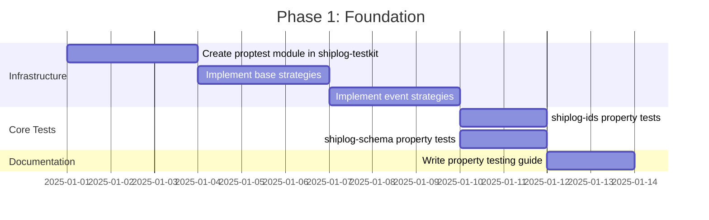

**Deliverables:**
- `shiplog-testkit::proptest` module with base strategies
- Property tests for `shiplog-ids`
- Property tests for `shiplog-schema`
- Developer documentation

### 6.2 Phase 2: Core Invariants (Weeks 3-4)

**Goal:** Implement property tests for core invariant categories.

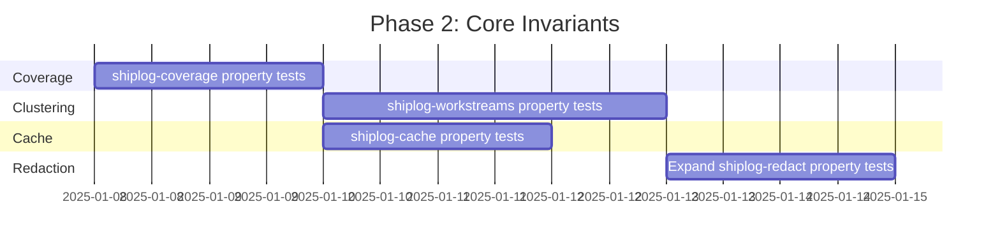

**Deliverables:**
- Property tests for `shiplog-coverage`
- Property tests for `shiplog-workstreams`
- Property tests for `shiplog-cache`
- Expanded property tests for `shiplog-redact`

### 6.3 Phase 3: Ingest Adapters (Weeks 5-6)

**Goal:** Implement property tests for existing ingest adapters.

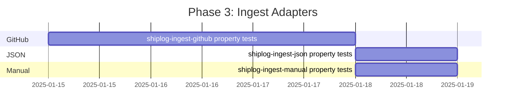

**Deliverables:**
- Property tests for `shiplog-ingest-github`
- Property tests for `shiplog-ingest-json`
- Property tests for `shiplog-ingest-manual`

### 6.4 Phase 4: Renderers and Bundles (Weeks 7-8)

**Goal:** Implement property tests for renderers and bundle creation.

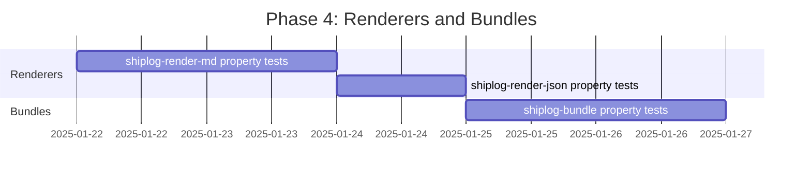

**Deliverables:**
- Property tests for `shiplog-render-md`
- Property tests for `shiplog-render-json`
- Property tests for `shiplog-bundle`

### 6.5 Phase 5: ROADMAP Features (Ongoing)

**Goal:** Add property tests as new features are implemented.

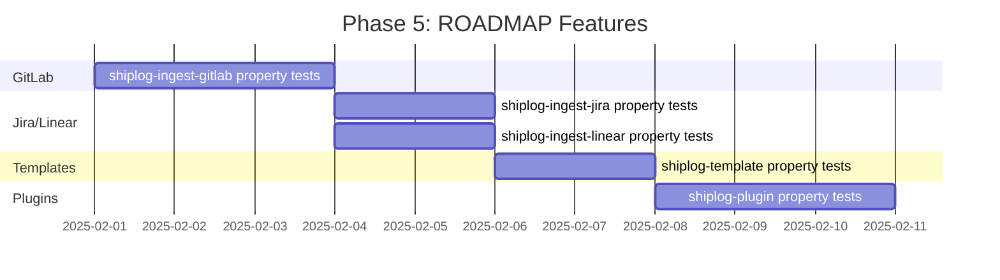

**Deliverables:**
- Property tests for GitLab ingest
- Property tests for Jira/Linear ingest
- Property tests for template rendering
- Property tests for plugin system

## 7. Best Practices and Guidelines

### 7.1 Writing Effective Property Tests

**DO:**

1. **Focus on invariants, not examples**
   ```rust
   // Good: Tests invariant
   prop_assert_eq!(id1, id2);

   // Bad: Tests specific example
   prop_assert_eq!(id.0, "abc123...");
   ```

2. **Use meaningful property names**
   ```rust
   // Good: Descriptive
   fn prop_aliases_are_stable_for_same_key(...)

   // Bad: Generic
   fn prop_test_1(...)
   ```

3. **Add helpful failure messages**
   ```rust
   prop_assert!(!json.contains(&title),
       "Title '{}' leaked in output: {}", title, json);
   ```

4. **Use prop_assume! for filtering**
   ```rust
   prop_assume!(since < until);
   ```

**DON'T:**

1. **Don't test implementation details**
   ```rust
   // Bad: Tests internal structure
   prop_assert_eq!(redactor.cache.len(), expected);
   ```

2. **Don't over-constrain inputs**
   ```rust
   // Bad: Too restrictive
   value in 100..200u32

   // Good: Reasonable range
   value in 0..10000u32
   ```

3. **Don't ignore shrink results**
   ```rust
   // Always review the minimal counterexample
   ```

### 7.2 Strategy Design Guidelines

**1. Keep strategies simple and composable**

```rust
// Good: Composable
fn strategy_event_envelope() -> impl Strategy<Value = EventEnvelope> {
    (
        strategy_event_id(),
        strategy_event_kind(),
        strategy_actor(),
        // ...
    ).prop_map(|(id, kind, actor, ...)| EventEnvelope { id, kind, actor, ... })
}

// Bad: Monolithic
fn strategy_event_envelope() -> impl Strategy<Value = EventEnvelope> {
    // Hundreds of lines of logic
}
```

**2. Use prop_filter! sparingly**

```rust
// Avoid: Inefficient filtering
value in 0..1000u32.prop_filter("even", |&v| v % 2 == 0)

// Prefer: Generate even values directly
value in (0..500u32).prop_map(|v| v * 2)
```

**3. Document strategy constraints**

```rust
/// Generates valid NaiveDate values within a reasonable range.
///
/// Constraints:
/// - Years: 1970-2100
/// - Always valid (no invalid dates like Feb 30)
fn strategy_naive_date() -> impl Strategy<Value = NaiveDate> {
    // ...
}
```

### 7.3 CI/CD Integration

**1. Separate test profiles**

```toml
# Cargo.toml
[profile.dev.package.proptest]
opt-level = 3

[profile.test]
opt-level = 2
```

**2. Test categorization**

```bash
# Run only property tests
cargo test --all --lib proptest

# Run only unit tests
cargo test --all --lib unit

# Run all tests
cargo test --all
```

**3. Artifact collection**

```yaml
# Save failing test cases
- name: Save counterexamples
  if: failure()
  run: |
    find . -name "*.regressions" -exec tar -czf counterexamples.tar.gz {} +
```

### 7.4 Maintenance

**1. Review counterexamples regularly**

- Schedule weekly reviews of new counterexamples
- Document bugs found by property tests
- Update invariants based on findings

**2. Update strategies as types evolve**

- When adding new enum variants, update strategies
- When adding new fields, update strategies
- When removing fields, update strategies

**3. Monitor test execution time**

- Track slow property tests
- Optimize strategies that generate many rejects
- Consider parallelizing independent tests

## 8. Conclusion

This property testing strategy provides a comprehensive framework for ensuring the correctness and reliability of the shiplog project. By systematically testing core invariants across all crates, we can:

1. **Catch bugs early** - Property tests find edge cases that hand-written tests miss
2. **Ensure correctness** - Invariants are verified across a wide range of inputs
3. **Improve confidence** - Randomized testing provides higher assurance than unit tests alone
4. **Reduce maintenance** - Property tests require less maintenance than hand-written tests
5. **Support evolution** - The strategy scales as new features are added

The phased implementation approach ensures that property testing capabilities are built incrementally, with each phase delivering value and building on the previous work.

## Appendix A: Property Test Checklist

When adding a new property test, ensure:

- [ ] Test name clearly describes the invariant being tested
- [ ] Input strategies are appropriate and efficient
- [ ] prop_assume! is used for filtering invalid cases
- [ ] Failure messages are helpful for debugging
- [ ] Shrink behavior is reasonable
- [ ] Test is added to CI
- [ ] Documentation is updated
- [ ] Counterexamples are reviewed

## Appendix B: Strategy Registry

| Strategy | Module | Purpose |
|----------|--------|---------|
| `strategy_naive_date()` | base | Generate valid dates |
| `strategy_datetime_utc()` | base | Generate UTC datetimes |
| `strategy_event_envelope()` | event | Generate complete events |
| `strategy_time_window()` | coverage | Generate time windows |
| `strategy_workstream()` | workstream | Generate workstreams |
| `strategy_cache_key()` | cache | Generate cache keys |
| `strategy_source_system()` | base | Generate SourceSystem enum |
| `strategy_repo_visibility()` | base | Generate RepoVisibility enum |
| `strategy_event_kind()` | base | Generate EventKind enum |

## Appendix C: Invariant Registry

| Invariant | Category | Crate | Status |
|-----------|----------|-------|--------|
| No Sensitive Data Leak | Redaction | shiplog-redact | ✓ |
| Aliases Are Stable | Redaction | shiplog-redact | ✓ |
| Windows Non-Overlapping | Coverage | shiplog-coverage | Planned |
| EventEnvelope JSON Round-Trip | Serialization | shiplog-schema | Planned |
| All Events Assigned | Clustering | shiplog-workstreams | Planned |
| Get-Set Round-Trip | Cache | shiplog-cache | Planned |
| EventId Determinism | ID Generation | shiplog-ids | Planned |

## Appendix D: References

- [Proptest Documentation](https://altsysrq.github.io/proptest-book/intro.html)
- [Property-Based Testing in Rust](https://blog.yoshuawuyts.com/property-based-testing-in-rust/)
- [Rust Testing Guidelines](https://rust-lang.github.io/api-guidelines/testing.html)
- [shiplog Project README](../README.md)
- [shiplog ROADMAP](../ROADMAP.md)
